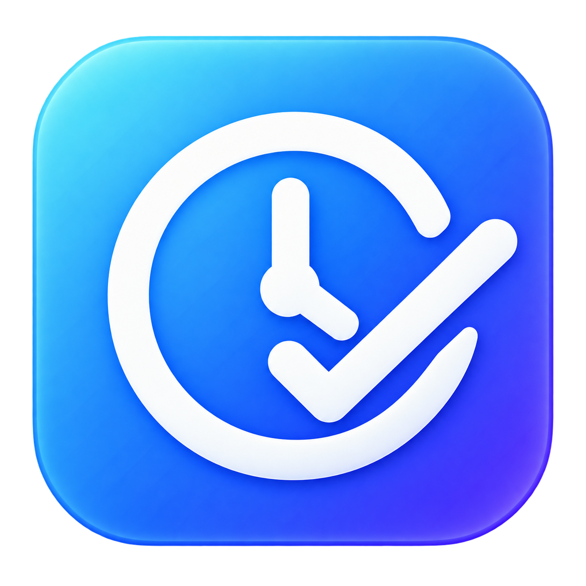

<div align="center">
  
  <h1>WHENWORK</h1>
  <p><b>생각난 할 일을 단축키 한 번으로 던져 두고, 오늘 볼 것만 한 화면에서.</b></p>
  <p>Windows · macOS 트레이 상주 앱 · 한국어</p>
</div>

---

설치 파일 하나를 받아 실행하면 끝입니다. 데이터베이스도, 계정도, 다른 프로그램도 필요 없습니다.

- **캡처는 잃지 않습니다** — `Ctrl+Alt+Space`로 던진 할 일은 디스크에 먼저 적힙니다. 저장소가 잠겨 있거나 앱이 강제 종료돼도 다음 실행에서 되살아납니다. 이걸 자동 테스트가 실제로 프로세스를 죽여 가며 증명합니다.
- **오늘 볼 것만** — 오늘·인박스·대기 세 탭. 분류는 던진 다음에 합니다.
- **키보드로 전부** — 마우스 없이 끝까지 조작됩니다.
- **데이터는 당신 것** — 전부 JSON 파일 하나로 내보내고, 다른 PC에서 그 파일로 되살립니다.

## 설치

[Releases](../../releases)에서 받으세요.

| OS | 파일 |
|---|---|
| Windows 10/11 | `WHENWORK-<버전>-win-x64.exe` |
| macOS (Apple Silicon) | `WHENWORK-<버전>-mac-arm64.dmg` |
| macOS (Intel) | `WHENWORK-<버전>-mac-x64.dmg` |

### 처음 실행할 때 경고가 뜹니다

코드 서명 인증서를 쓰지 않아서 두 OS 모두 경고를 냅니다. 서명에는 연 수십만 원이 들고, 이 앱은 그 비용을 쓰지 않습니다. 대신 무엇을 하는 앱인지는 이 저장소의 코드가 전부입니다.

**Windows** — "Windows의 PC 보호" 파란 창이 뜨면 **추가 정보** → **실행**을 누릅니다.

**macOS** — "확인되지 않은 개발자" 경고가 뜨면:

1. `WHENWORK.app`을 응용 프로그램으로 옮깁니다
2. 앱을 **우클릭 → 열기** (더블클릭이 아니라 우클릭입니다)
3. 다시 뜨는 창에서 **열기**

그래도 막히면 터미널에서 격리 속성을 지웁니다:

```bash
xattr -dr com.apple.quarantine /Applications/WHENWORK.app
```

## 쓰는 법

### 캡처

`Ctrl+Alt+Space` — 어느 화면에서든 한 줄 입력창이 뜹니다. `Enter`로 저장하면 창은 그대로 있어 연달아 던질 수 있고, `Tab`이면 오늘 뷰로 넘어갑니다.

`#약어`를 앞이나 끝에 붙이면 인박스를 건너뛰고 그 프로젝트로 바로 갑니다 — `보고서 초안 #ex` = `#ex 보고서 초안`. 치는 동안 어디로 가는지 보여주고, 없는 약어면 그때 알린 뒤 토큰을 제목에 남깁니다.

### 오늘 뷰

트레이(macOS는 메뉴바) 아이콘을 누르거나 단축키로 엽니다.

| 키 | 하는 일 |
|---|---|
| `Tab` | 탭 전환 (오늘 · 인박스 · 대기 · 프로젝트 · 설정) |
| `↑↓` 또는 `jk` | 이동 · `Home`/`End`/`PgUp`/`PgDn` 점프 |
| `Space` | 완료 |
| `1`~`9` | 프로젝트 지정 |
| `E` `D` `N` | 제목 · 마감 · 메모 |
| `W` | 대기로 넘기기 · 대기 탭에서 `P`는 재촉 기록 |
| `X` / `U` | 삭제 / 되돌리기 |
| `F` `H` | 마감 있는 것만 / 완료 기록 |
| `/` | 검색 — 제목·메모·프로젝트·대기 상대를 한꺼번에 |
| `?` | 전체 키맵 |

마우스로는 체크박스를 눌러 완료할 수 있습니다.

### 아침 브리핑

하루 한 번, 정한 시각에 오늘 마감·지연·오래 기다린 항목을 알립니다. 설정에서 시각을 바꾸거나 끌 수 있습니다. 알림 권한이 막혀 있으면 앱 안 표시로 대신 보여줍니다 — 조용히 사라지지 않습니다.

### 내 데이터

설정 탭에서 `E`로 전부 JSON 하나로 내보내고, `I`로 되살립니다. 가져오기는 지금 데이터를 파일의 내용으로 **갈아끼우고**, 직전 상태를 자동으로 백업합니다.

데이터는 앱 데이터 폴더의 `store.sqlite` 하나에 있습니다. 설정 탭이 그 경로를 보여줍니다.

## 직접 빌드하기

```bash
npm install          # postinstall이 아이콘을 굽는다
npm start            # 개발 실행
npm test             # 전체 테스트
npm run smoke        # 창을 띄우지 않고 렌더러까지 자가진단
npm run smoke:crash  # 캡처 직후 강제 종료해도 살아남는지 (실제 프로세스를 죽인다)

npm run build        # Windows 설치 파일 → dist/
npm run build:mac    # macOS dmg·zip → dist/
```

Node 22 이상이 필요합니다 (저장소가 `node:sqlite`를 씁니다).

개발 실행과 설치본은 `app.setName('whenwork')`로 **같은 데이터 폴더를 공유**하고 단일 인스턴스 락을 나눠 갖습니다. 코드를 고쳐 `npm start`로 확인하려면 트레이에서 설치본을 먼저 종료해야 합니다.

## 만들어진 방식

`main/`은 Electron 메인 프로세스, `renderer/`는 화면입니다. OS 분기는 `main/platform/` 안에만 있습니다 — 한쪽 OS에서만 도는 코드가 파일 전체로 번지지 않도록 계약 테스트가 지킵니다.

캡처 경로는 한 줄기뿐입니다: `queue.append`로 디스크에 먼저 적고, 저장소 반영을 시도하고, 실패하면 대기 건수로만 드러냅니다. 예외를 위로 올리지 않습니다 — 캡처 창이 실패를 보여줘야 할 이유가 없기 때문입니다.

## 라이선스

코드는 MIT. 번들된 [Pretendard](https://github.com/orioncactus/pretendard) 글꼴은 SIL Open Font License 1.1을 따릅니다.
