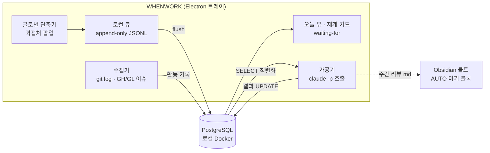
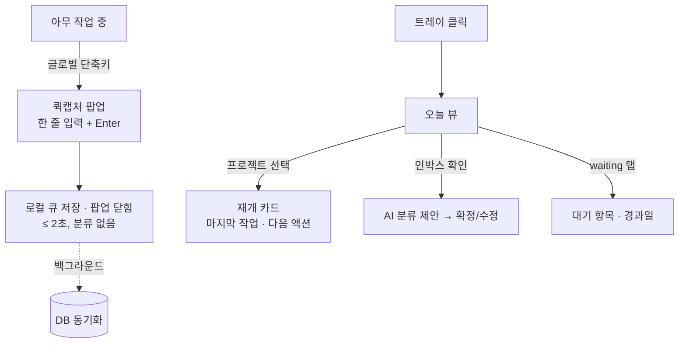

# WHENWORK 설계 v2.14

개인용 프로젝트별 업무 관리 트레이 앱. 2026-08-05 초안 (개정 이력은 문서 끝).

## 1. 배경·목적

여러 프로젝트(시재건설·서식갤러리·GoWrite·eformsign 등)를 오가며 일하는 1인 사용자의 업무 관리 도구.
기존 자동화(auto-worklog)가 **"한 일"의 수집은 해결**했으나, 다음 공백이 남아 있다:

1. **할 일 캡처** — 생각난 할 일이 머릿속·메신저·포스트잇에 흩어진다
2. **재개 컨텍스트** — 프로젝트 전환 시 "어디까지 했더라"를 매번 재구성한다
3. **대기 추적** — 남에게 요청해놓고 회신을 기다리는 항목이 잊힌다

목적 우선순위: **① 캡처 손실 제로 ② 컨텍스트 스위칭 비용 절감 ③ 주간 회고 자동화**

## 2. 페르소나 → 도출 요구

| 페르소나 특성 | 도출되는 요구 |
|---|---|
| 1인 사용자, 팀 협업 없음 | 권한·공유·멀티유저 기능 전면 배제 |
| 하루 종일 IDE·터미널에 있음 | 어디서든 닿는 글로벌 단축키 캡처, 키보드 중심 조작 |
| 도구에 기록할 시간이 없음 | **입력 비용 최소화가 제1원칙** — 캡처 시점에 분류를 강요하지 않는다 |
| 작업 흔적이 이미 git에 남음 | "한 일"은 자동 수집, 손 입력은 "할 일"에만 국한 |
| Claude 구독 보유, API 키 없음 | AI 가공은 `claude -p`(구독 OAuth)로 — 추가 비용 0 |
| Obsidian 볼트 운영 중 | 산출 문서(주간 리뷰)는 볼트와 공존 가능해야 함 |

## 3. 스코프

### v1 포함
- 트레이 상주 앱 (Windows 우선, claude-office 패턴)
- 글로벌 단축키 퀵캡처 (원라인 인박스)
- 오늘 뷰 (프로젝트 횡단)
- 프로젝트별 재개 카드 (git 활동 + AI 요약)
- waiting-for 추적
- 주간 리뷰 초안 (AI)

### v1 제외 (근거)
- 간트·의존성 그래프·리소스 관리 — 팀용 기능, 1인에게 과설계
- 시간 추적 — 캡처 부담을 늘림, 커밋 로그가 대체
- 모바일 — 사용 맥락이 PC 작업 중 캡처에 집중됨
- 알림·리마인더 — v2 후보 (오픈이슈 #3)

## 4. 벤치마크 요약

| 도구 | 취할 것 | 버릴 것 |
|---|---|---|
| Linear | 키보드 중심 속도, 자연어→이슈 | 팀·사이클 개념 |
| Things/OmniFocus | 퀵캡처 UX, 오늘 뷰, waiting-for(GTD) | 수동 입력 의존 |
| Obsidian Tasks | 로컬 소유권, 파일 친화 | 쿼리 성능·구조화 한계 |
| auto-worklog(자체) | 마커 블록, git 런타임 스캔, `claude -p` 가공 | — 그대로 계승 |

## 5. 아키텍처



### 핵심 설계 결정

| # | 결정 | 근거 | 폐기한 대안 |
|---|---|---|---|
| D1 | 캡처는 **로컬 큐 선기록 → DB 후동기화** | Docker 미기동 시에도 캡처가 절대 실패하지 않아야 함 (목적 ①) | DB 직접 INSERT — 의존성이 캡처 경로에 들어와 폐기 |
| D2 | 저장소 = **PostgreSQL (로컬 Docker)** | 구조화 쿼리(오늘 뷰·waiting-for 필터), 익숙한 스택(kwork365-be), 웹 UI 확장 여지 | SQLite — 의존성은 적으나 사용자가 Docker DB 운용을 선택. D1로 리스크 상쇄 |
| D3 | AI 호출 = **`claude -p` 구독 OAuth** | API 키 불필요, auto-worklog에서 검증된 패턴, 비용 0 | Agent SDK — 구독 인증 불가(API 키 필수)라 폐기. 정식 배포 시 재검토 |
| D4 | AI 쓰기는 **앱이 중개** — Claude는 텍스트만 반환 | 자동 실행에서 AI에 DB 쓰기 권한을 주지 않는다 (auto-worklog 관심사 분리 계승) | `--allowedTools`로 직접 쓰기 — 통제 불가라 폐기 |
| D5 | DB가 단일 원본, **볼트는 생성된 뷰** | "git이 원본, 볼트는 뷰"인 업무일지와 동일한 관계. 같은 내용을 양쪽에서 고치지 않는다 | 볼트를 원본으로 — 쿼리 불가·파싱 취약이라 폐기 |
| D6 | Electron **vanilla ESM + electron-builder** | claude-office에서 검증(빌드·트레이·아이콘 파이프라인 재사용). 프레임워크·번들러 무추가 | Next.js/React — v1 화면 3개에 과설계 |
| D7 | GH/GL 이슈는 **읽기 전용 캐시** — 수집기가 "내가 작성했거나 할당된 이슈"를 동기화, 원본은 GitHub/GitLab | 프로젝트 상세에서 이슈 확인 요구. 오프라인 시 마지막 캐시 표시. 조회는 `gh`/`glab` CLI 인증 재사용 | 앱 내 이슈 작성·편집 — 원본 이원화라 폐기. 클릭 시 브라우저로 이동 |

### AI 가공 단계 (유일한 `claude -p` 접점)

| 작업 | 트리거 | 입력 → 출력 |
|---|---|---|
| 인박스 분류 | 수동 또는 캡처 누적 시 | 미분류 항목 + 프로젝트 목록 → 프로젝트·태그 제안 (확정은 사용자) |
| 재개 카드 갱신 | 일 1회 + 수동 | 프로젝트별 최근 커밋·완료 항목 → "마지막 작업 / 멈춘 지점 / 다음 액션 1개" |
| 주간 리뷰 초안 | 주가 끝나면 자동 1회 + 수동 | 주간 활동 전체 → 리뷰 md 초안 (볼트 AUTO 마커 블록에 삽입) |

## 6. 데이터 모델 (초안)

```
project    (id, name, repo_paths[], status, sort)
item       (id, project_id?, kind: inbox|todo|waiting, title,
            due?, waiting_for?, captured_at, done_at?, source: manual|ai)
activity   (id, project_id, occurred_at, kind: commit|note, ref, summary)   -- 수집기가 적재, 불변
issue      (id, project_id, provider: github|gitlab, number, title, state,
            relation: author|assignee|both, url, updated_at, synced_at)     -- 내 이슈 캐시(작성·할당), 읽기 전용 (D7)
resume_card(project_id PK, last_work, stuck_point, next_action, generated_at) -- AI 생성물, 항상 재생성 가능
```

원칙: **AI 생성물(resume_card, 분류 제안)은 언제든 버리고 재생성 가능**해야 한다. 사람 입력(item)과 자동 수집(activity)이 원본.

## 7. UX 플로우



게이트: 퀵캡처는 **입력→저장까지 어떤 선택지도 띄우지 않는다**. 분류·마감·프로젝트 지정은 전부 나중(인박스 정리 시점)으로 미룬다.

## 8. 마일스톤 — 단계별 주 액션 교체

| 단계 | 내용 | 사용자의 주 액션 | 완료 판정 |
|---|---|---|---|
| M1 | 트레이 + 퀵캡처 + 로컬 큐 + DB + 오늘 뷰 | "생각나면 단축키로 던진다" | 1주간 캡처 손실 0건 |
| M2 | git 수집기 + 재개 카드 (`claude -p`) | "프로젝트 열기 전에 카드부터 본다" | 카드만 보고 작업 재개 가능 |
| M3 | 인박스 AI 분류 + waiting-for + 주간 리뷰 | "금요일에 리뷰 초안만 다듬는다" | 리뷰 작성 시간 체감 절반 |

## 9. KPI

| 목표 | 지표 | 데이터원 |
|---|---|---|
| 캡처 손실 제로 | 일일 캡처 수 추이 (하락 = 도구 이탈 신호) | item.captured_at |
| 스위칭 비용 절감 | 재개 카드 열람 수 / 프로젝트 전환 수 | 앱 이벤트 로그 |
| 회고 자동화 | 주간 리뷰 초안 수정률 (낮을수록 초안 품질 ↑) | 볼트 diff |

## 10. 오픈이슈

- ~~**#1** 주간 리뷰의 볼트 출력 위치~~ — 닫음(2026-08-05). 같은 월 폴더에 **별도 파일** `00_업무일지/YYYY년/MM월/00_주간리뷰_YYYY-Www.md`. 일일 업무일지·월간요약(`AUTO:ROLLUP`)은 커밋에서 뽑은 "무엇을 했나"이고 주간 리뷰는 흐름·판단·다음 초점이라 성격이 달라 중복되지 않는다. 파일 안에서도 `AUTO:WEEKLY` 마커 안쪽만 갈아끼워 사람이 덧붙인 메모는 보존한다
- ~~**#2** auto-worklog와 git 스캔 중복~~ — 닫음(2026-08-06). **수집기는 공유하지 않는다** — whenwork는 캡처가 절대 실패하지 않아야 하는 앱이라 외부 스크립트에 묶이지 않는다(D1). 중복 자체는 비용이 아니고(수백 ms) 진짜 위험은 **판정 규칙이 갈리는 것**이었다: 같은 주를 주간 리뷰와 일일 업무일지가 다르게 세면 회고가 어긋난다. 실제로 갈린 것은 `--all` 하나였다 — 없으면 체크아웃한 브랜치의 조상만 세므로 아직 머지하지 않은 브랜치의 작업이 빠진다(실측 gowrite 241 vs 242, 나머지 6개 리포는 동일). 그것만 맞췄고 저자 판정은 whenwork 쪽(리포 `user.email`)을 유지한다 — auto-worklog의 이름 정규식(`when630`)보다 견고하고, 이름을 코드에 박지 않는다. 규칙은 `logArgs`에 모아 테스트로 굳혔다
- ~~**#3** 알림·리마인더(due 임박, waiting 경과)~~ — 닫음(2026-08-05). **아침 브리핑 하나로** 갈음한다: 설정 시각(기본 09:00) 이후 앱이 도는 첫 순간에 지연·오늘 마감·5일 넘은 대기·인박스 건수를 한 줄로 알린다. 항목마다 알리지 않는 이유는 개인용 도구에서 알림이 잦아지면 그때부터 전부 무시하게 되기 때문이다. 챙길 게 없으면 알리지 않고, 창(3시간)을 놓친 날은 조용히 넘겨 밀린 알림을 몰아 보내지 않는다. 판단은 `main/brief.mjs`(테스트 대상)
- ~~**#4** `claude -p` 사용량이 구독 한도를 공유~~ — 닫음(2026-08-10). 빈도를 낮게 유지하는 장치는 이미 있었고(카드는 새 커밋이 들어온 프로젝트만·실패 시 10분 쿨다운·프로젝트별 중복 호출 방지), 문제는 **"초과 시 조정"이라 적어두고 호출 수를 재는 창구가 없던 것**이라 2026-08-06에 `ai_call` 이벤트(작업·성공/실패·소요 시간)를 남기고 주간 지표에 「AI 호출 N회」로 드러냈다. **4일 실측 결과 총 9회**(8/7 6 · 8/8 2 · 8/10 1)로 한도 근처도 아니다 — 조정할 것이 없어 닫는다. 계량은 그대로 둔다(끄면 다음에 또 같은 질문을 근거 없이 하게 된다). 주간 리뷰 자동 생성이 붙어 주 1회가 더해지지만 같은 결론이다
- ~~**#6** 캘린더 연동~~ — 닫음(2026-08-06). **Apps Script 웹앱**으로 풀었다. 회사 Workspace가 iCal 비공개 주소를 막았고, 공개 iCal은 캘린더를 인터넷에 공개해야 하는 데다 "한가함/바쁨"이라 제목 없이 `Busy`만 왔다(`cid=...` 링크는 캘린더 ID의 base64일 뿐 인증 문제를 풀지 못한다). 웹앱은 **내 권한으로** 캘린더를 읽어 캘린더를 공개하지 않고도 제목까지 받고, GCP OAuth 클라이언트 발급도 필요 없으며, `getEvents`가 반복 일정을 이미 펼쳐 주므로 RRULE 해석도 우리 몫이 아니다. 스크립트는 `docs/apps-script-calendar.gs`. 대가는 배포를 "모든 사용자"로 열어야 한다는 것 — URL·토큰이 곧 비밀이라 내보내는 필드를 제목·시각·장소로 제한했다. 이 과정에서 직접 만들었던 ics 파서(`main/ical.mjs`)는 쓸 자리가 없어 지웠다 — 필요해지면 커밋 `435fe32`에서 되살린다
- ~~**#5** 이슈 수집의 계정 매핑~~ — 닫음(2026-08-05). `when630-forcs`(Mobility365 등) 리포는 당분간 쓰지 않기로 해 다중 계정 전환이 불필요해졌다. 현재 인증(`gh`=when630, `glab`=lab.oz4cs.com)으로 매핑된 프로젝트는 모두 조회된다. eformsign도 리포 연결 없이 둔다

## 11. UI 확정 사항 (목업 검토, `docs/mockups/`)

| 항목 | 결정 |
|---|---|
| 테마 | 다크 단일 (IDE 다크 환경 전제), 악센트 `#7aa2f7` 블루 |
| 트레이 창 | 880×680 화면 중앙(커서 디스플레이), 탭 7개(오늘/인박스/대기/이슈/프로젝트/리뷰/설정) `Tab` 순환. 단축키 재입력 또는 `Esc`로 닫힘. **트레이 클릭도 토글이다** — 트레이를 누르면 blur가 먼저 와 창이 접히고 그 뒤 click이 다시 열어서 트레이로는 닫을 수 없었다. 접힌 지 400ms 안의 클릭은 "닫으려는 클릭"으로 본다 |
| 전역 캡처 핫키 | `Ctrl+Alt+Space` (기존 Claude 바인딩은 사용자가 해제) |
| 퀵캡처 | 선택 UI 없음. 저장해도 **창은 닫지 않는다** — 입력만 비우고 ✓ 피드백(연달아 던지기·앱 열기 대비). 닫기는 `Esc`/단축키 재입력, `Tab`은 오늘 뷰. DB 오프라인은 에러 아닌 상태(황색 큐 표시) |
| 입력 방어 | 전역 단축키의 Space가 입력창에 새는 문제 → **선두 공백 입력 금지**(타이밍 가드 아님). 단어 사이 공백은 그대로 |
| 창 스타일 | 그림자·라운드는 CSS가 아니라 Win11 네이티브. 프레임리스는 `resizable: false`면 WS_THICKFRAME이 빠져 둘 다 사라지므로, 창은 resizable로 두고 고정이 필요하면 min=max로 묶는다 |
| 창 위치 | 두 창 모두 드래그로 옮길 수 있고 옮긴 자리를 `userData/settings.json`에 기억한다. 저장된 자리가 지금 화면 밖이면(모니터 변경 등) 버리고 가운데로 — 트레이의 「창 위치 초기화」로도 되돌린다 |
| 프로젝트 인지 | 캡처 시 포그라운드 컨텍스트 자동 기록(창 아이콘 표식) + 인박스 AI 분류 기본, `#약어` 인라인 토큰은 옵션. **`GetForegroundWindow` 하나로는 안 된다** — PowerShell 기동(Add-Type의 C# 컴파일)이 300ms 넘게 걸려 그 사이 우리 팝업이 포그라운드가 되어 있고, 실제로 실사용 13건 전부 컨텍스트가 `"퀵캡처"`(우리 창 제목)로 남아 기능이 죽어 있었다. 그래서 **우리 프로세스가 가진 창을 후보에서 빼고** z-order를 따라 첫 실제 창을 고른다(안 보이는 창·클로킹된 UWP 유령 창·도구 창·제목 없는 창은 건너뛴다). 시점에 의존하지 않으므로 팝업이 뜬 뒤에 실행돼도 답이 같다. **그 폴백에서는 항상 위(`WS_EX_TOPMOST`) 창도 건너뛴다** — z-order는 topmost 창을 전부 일반 창보다 앞에 세우므로, 우리 창만 빼고 나니 항상 위로 상주하는 앱 하나가 새 상수가 됐다(캡처 5건 전부 `"Claude Office"`, 12.9절). 포그라운드가 이미 실제 창이면 항상 위여도 그대로 쓴다 — 그 창을 직접 눌러 쓰던 중이었다면 그게 맞는 답이다 |
| 글꼴 | 번들한 **Pretendard 가변**(`renderer/fonts`, OFL). CSP가 외부 로딩을 막으므로 파일 동봉. "Pretendard KR"이라는 별도 패밀리는 공식 배포에 없음 — 기본 Pretendard가 한글판이고 변형은 JP·Std·GOV |
| 아이콘 | 이모지 대신 **인라인 SVG 선 아이콘**(`renderer/icons.js`) — `currentColor`를 따라 색·크기가 폰트에 좌우되지 않는다 |
| 하단 힌트 | 푸터에는 **그 화면에서 지금 쓸 것 네 칸 남짓**만 두고 나머지는 `?` 전체 키맵에서 본다 — 힌트를 다 늘어놓으면(오늘 탭이 11칸까지 갔다) 폭을 넘어 잘리고 결국 아무것도 읽히지 않는다. 관습적인 키(`Tab`·`/`·`Esc`)는 키맵에만 두고, `Esc`는 **뜻이 바뀔 때만**(검색이 걸려 있을 때) 푸터에 드러낸다. 키맵은 관심별로 묶는다(이동·항목·탭별·재개 카드·리뷰·설정·퀵캡처) — 나열보다 배우기 쉽고, 앱 안의 유일한 조작 문서 역할을 한다. 스모크가 힌트 칸 수와 **잘림 여부**(`scrollWidth`)를 재고 `?`·`Esc`를 실제로 눌러 본다 |
| 문안 | 화면 문구는 **명사형으로 끝낸다**(`~습니다`·`~하세요`를 쓰지 않는다). 구조는 `대상 — 결과`, 실패는 `<무엇> 실패 — <원인>`, 막힌 이유는 `<대상> 없음`, 중복 실행은 `이미 <동작> 중`. **이미 화면에 보이는 상태는 알리지 않는다** — 대기 탭에서 프로젝트를 바꿀 때 칩이 그 자리에서 바뀌므로 토스트를 띄우지 않는 것이 그 예다. 꼬리에 동작을 설명하는 말(`· 경과를 지금부터 다시 셉니다`)을 붙이지 않고, 다음에 누를 키(`· U로 되돌리기`)만 남긴다. `claude -p`·캘린더 웹앱의 오류 문구도 같은 규칙을 따른다(사용자에게는 그것이 곧 화면 문구다) |
| `#약어` 토큰 | **앞뒤 어디든 받는다**(`오늘 할일 #gw` = `#gw 오늘 할일`) — 끝만 받던 동안 앞에 치면 조용히 인박스로 갔다. 앞을 열면 `#201 이슈 확인`처럼 번호를 앞에 쓰는 습관과 부딪히지만, 어느 프로젝트도 가리키지 않는 토큰은 플러시 때 **원문 그대로** 되살아나므로 제목을 잃지 않는다(큐 항목에 `raw`를 함께 담는다). 약어를 **타이핑하는 곳은 퀵캡처뿐인데** 확인할 화면(번호 띠·프로젝트 탭)은 그 창이 떠 있는 동안 볼 수 없어, 외우지 못하면 못 쓰는 기능이었다. 그래서 쓰는 자리에서 알려준다: 치는 동안 `#gw → GoWrite`(악센트), 없는 약어면 `#gwx — 없는 약어`(황색), 저장 뒤에는 `✓ GoWrite로 저장`. 약어 목록은 **렌더러가 가져간다**(`capture:projects` invoke) — main이 창을 만들자마자 push하면 리스너가 아직 없어 그 메시지가 사라지고, 그래서 **앱 재시작 후 첫 퀵캡처에서는 어떤 약어도 인식하지 못했다**(실사용에서 드러났다). 창을 열 때마다 다시 가져오고(프로젝트·약어는 수시로 바뀐다) DB가 꺼져 있으면 마지막 목록으로 답한다 — 캡처 경로에 DB를 끌어들이지 않는다(D1). 판정 규칙은 `parseCaptureToken`과 같아야 한다(여기서 알려주고 푸는 건 플러시 시점). 푸터 힌트는 **실제로 통하는 약어**를 보여준다(`#gw`) — 「#약어」라고만 적어두면 그 글자를 그대로 치게 된다. **없는 약어는 토큰을 제목에 되돌려 넣는다**(`insertCaptures`) — 조용히 떼어내면 인박스에서 오타를 알아챌 단서가 사라진다 |
| 첫 화면 | 창을 열면 **오늘**부터다. 인박스를 기본으로 두었더니 다 분류해 둔 날은 빈 화면으로 열렸다(인박스 0건 vs 할 일 8건). 다만 첫 로드에서 인박스에 쌓인 게 있으면 그쪽으로 옮기고, **퀵캡처에서 `Tab`으로 건너온 길**은 방금 던진 것을 정리하러 온 것이므로 그때도 인박스를 본다(`today:fromCapture`). 매 갱신마다 고르지는 않는다 — 일하는 중에 탭이 저절로 바뀌면 안 된다 |
| 이슈 탭 | 열린 이슈·PR을 **프로젝트별로** 늘어놓는 탭. 재개 카드 안에만 있어서 오늘 뷰에서 놓쳤고(열린 이슈 16건 vs todo 4건), 그래서 `T` 승격이 이틀째 0회였다 — 키가 아니라 **자리** 문제였다. 탭 배지에 열린 건수가 늘 보이고, `T`로 오늘 할 일, `Enter`/`O`로 원본, `/`로 검색한다. 이미 세운 것은 목록에 남기고 「할 일」 표식만 붙인다(사라지면 "그 이슈는 어디 갔지"가 된다). 행 모양은 재개 카드 3단과 같은 `issueRow`를 쓴다. **원본으로 가는 문은 번호**(`#210`)이고 행 클릭은 선택이다 — 더블클릭에 걸었더니 클릭마다 행이 다시 그려져 노드가 갈리는 통에 믿을 수 없었고, 재개 카드 쪽도 같은 규칙으로 맞췄다(마우스로 고른 뒤 `T`를 누를 수 있다). 목록 안에 서는 행은 재개 카드용 음수 마진을 되돌려 항목 행과 좌우를 맞춘다(`.issue.in-tab`) |
| 마우스 | 키보드가 원칙이지만 **눌러도 되게 생긴 것은 눌린다** — 체크박스 클릭이 `Space`와 같은 길(`toggleDone`)을 타고, 진행 중인 회의 줄의 「M 후속」 표식도 누르면 `M`과 같은 일을 한다. 눌리지 않는데 눌릴 것처럼 생긴 것이 문제였다. 반대로 **다이얼로그·키맵이 떠 있는 동안은 뒤쪽을 클릭으로도 만지지 못한다**(`.app`의 `pointer-events`) — 키는 막아뒀는데 마우스가 열려 있어서 마감일을 묻는 창을 띄운 채 다른 행의 체크박스를 눌러 엉뚱한 항목을 완료할 수 있었다 |
| 프로젝트 번호 | `1~9`는 프로젝트 탭 순서인데 "무엇이 몇 번인지"를 알 방법이 없었다(번호 목록이 인박스 목록 **맨 아래**에만 있어 항목이 쌓이면 화면 밖으로 밀렸다). 두 가지로 함께 푼다: ① 번호 띠를 **스크롤 밖 고정 자리**(본문과 푸터 사이)로 올려 `1~9`를 쓰는 탭(오늘·인박스·대기)에서 상시 노출하고 약어까지 병기한다(`1 GoWrite #gw` — 캡처 토큰과 같은 어휘를 한자리에서 익힌다) ② **프로젝트 이름 칩마다 번호를 단다**(오늘 탭 그룹 머리글·대기 행·AI 제안 — `projChip` 하나로 만든다). 번호를 따로 적어두기만 하면 아무도 외우지 않으므로, 이름이 보이는 곳마다 번호가 함께 보이게 하는 쪽이 본질이다. 순서를 바꾸면 번호가 밀리는 것은 그대로 두었다 — 화면이 늘 정답을 보여주므로 외울 필요가 없다(고정 슬롯 번호는 관리할 것이 하나 늘어 접었다) |
| 인박스 분류 키 | 2안 숫자 다이렉트 — `Enter` 제안 확정 · `1~9` 프로젝트 지정 · `W` 대기 · `X` 삭제 · 탭 전환은 `Tab` 순환 |
| AI 생성물 표식 | 보라 ✦ 상시 구분, 실패 시에도 git 활동·todo는 정상 표시 |
| 프로젝트 상세 | 3단 구성: AI 재개 카드 + git 활동 + 내 GH/GL 이슈(작성·할당 — 할당만은 「할당」 배지, 열림 우선, 클릭 시 브라우저, 오프라인은 캐시 황색 표시) |
| 프로젝트 관리 | 시드·하드코딩 없음 — 앱의 프로젝트 탭에서 추가(`N`)·이름(`E`)·약어(`A`)·리포 연결(`R`)·순서(`Shift+↑↓`)·보관(`X`). 순서가 인박스 `1~9` 번호. DB `project` 테이블이 유일 원본 |
| 스크롤 | 목록에서 `Home`/`End`/`PgUp`/`PgDn`은 스크롤이 아니라 **선택 점프**이고, 스크롤은 선택을 따라온다(`scrollIntoView({block:'nearest'})`). 문서형 화면(리뷰 본문·재개 카드·완료 기록)에서는 반대로 그 키들이 본문을 굴린다. 렌더가 본문을 통째로 다시 그리므로 스크롤 위치는 render가 기억해 되돌리고, 탭·뷰가 바뀔 때만 위로 올린다 |
| 삭제·되돌리기 | `X`는 **소프트 삭제**(`item.deleted_at`)이고 `U`로 되돌린다(연달아 지웠으면 누른 만큼 거꾸로). 30일이 지난 것만 실제로 지운다 — 한 키에 영구히 사라지는 항목이 있으면 "캡처 손실 0건"이 성립하지 않는다. 프로젝트 보관은 기존대로 `y` 확인. `U` 스택에는 **재촉(`P`)도 함께 쌓인다** — 확인 없이 한 키로 끝나고 취소할 수 없던 조작이 그 둘이다 |
| 검색 | `/` 한 키. 제목·메모·프로젝트명·대기 상대를 낱말 AND로 훑고, **탭을 옮겨도 유지**하며 탭 배지 숫자를 매칭 건수로 바꾼다(어느 탭에 있는지 모르는 항목을 찾는 게 목적). `Esc`는 필터부터 풀고, 한 번 더 눌러야 창이 닫힌다. 입력 중의 `Tab`도 **여기서 직접 처리한다** — 기본 동작에 맡기면 입력창에서 포커스만 빠지고 검색 상태는 남아 그 뒤 모든 키가 삼켜진다(Esc·Enter·화살표만 반응하는 죽은 화면) |
| 오늘 탭 | **프로젝트별 그룹만** 두고 그룹 순서는 **프로젝트 탭 순서**(= `1~9` 번호)를 따른다 — 항목이 마감 순으로 오므로 첫 등장 순서로 묶으면 그룹 자리가 매일 바뀌어 위치로 기억할 수 없다(번호를 붙이고 나서 `5 → 4 → 1`로 어긋난 것이 눈에 드러났다). 급한 것(지연·오늘 마감)을 맨 위 별도 그룹으로 뽑아봤지만 한 화면에 그룹 기준이 둘이 되어 어수선했다 — 급한 건 마감 배지(`D+2`·`오늘`)가 알리고 그룹 안에서는 이미 마감 빠른 순으로 선다. `F`로 마감 있는 것만 보기(방금 완료한 것은 남긴다). 배치는 `renderer/view.js`의 `todayGroups`가 유일한 기준 — 그리는 순서와 선택 인덱스가 같은 함수를 쓴다 |
| 일정 표시 | 오늘 탭 맨 위 **타임라인**. 축은 각 행이 정수 좌표(`--axis-x`)로 자기 높이만큼 그려 잇는다(소수점 좌표는 배율 환경에서 행마다 반올림이 갈려 두 줄로 어긋난다). "지금"은 아직 시작 안 한 첫 일정 앞에 점선으로, 종일은 축 밖에. 상태 클래스에 **`tl-` 접두사가 필수** — 이 CSS는 전역이라 `.next` 같은 이름은 재개 카드가 이미 쓰고 있어 padding·배경이 딸려온다 |
| 완료 기록 | `H` — 최근 7일을 하루 단위로, 체크한 항목과 git 커밋을 함께. 오늘 뷰가 완료를 12시간만 남기므로 "어제 뭐 했지"를 볼 창구가 없었다. 커밋은 하루 12건까지만 보여주고 나머지는 건수로 접는다 |
| 설정 | 토큰이 박힌 값(`캘린더 웹앱 URL`)은 **빈 입력으로 지워지지 않는다** — 붙여넣기 창에서 그냥 `Enter`를 누르면 취소이고 해제는 `X`로만 하며, 그 `X`도 `y` 확인을 받는다(화면에는 가린 값만 있어 앱에서 되살릴 수 없다). 탭 하나(`설정`)에서 볼트 경로·백업 폴더(폴더 선택 다이얼로그)·아침 알림 on/off·시각. **DB 접속은 앱에서 만지지 않는다** — `settings.json`의 `db`를 고치고 재시작하는 쪽이 안전하다. 값이 비어 있으면 무엇이 대신 쓰이는지(자동 탐색 결과·기본 폴더)를 그 자리에 적는다 |
| 볼트 경로 | 코드에 박지 않는다. 설정에 없으면 홈 아래 두 단계까지에서 `00_업무일지`를 가진 폴더를 한 번 찾아 기억하고(못 찾으면 다시 훑지 않는다), 끝까지 없으면 초안은 DB에만 남는다 |
| 이슈·PR | `gh issue list`는 PR을 포함하지 않아 따로 긁는다. **리뷰 요청받은 PR**은 남을 막고 있는 일이라 열림 다음의 정렬 우선순위이고 AI 프롬프트에도 그렇게 알린다. 머지는 닫힘과 구분해 남긴다(그 작업이 끝났다는 신호). GitLab은 issue iid와 MR iid가 별개 공간이라 유일 키에 `kind`가 들어간다 |
| 재개 카드 신선도 | 카드는 **여는 순간이 아니라 수집 직후에 미리** 만든다(`prewarmCards`). 열어서 30초를 기다리면 "열기 전에 카드부터 본다"는 습관이 붙지 않는다. 낡음의 기준은 시각이 아니라 **생성 후 새 커밋 수** — 24시간이 지났어도 커밋이 없으면 같은 자료로 같은 카드를 다시 만드는 것뿐이라 재생성하지 않는다(구독 한도, 오픈이슈 #4). 그 숫자는 카드 머리에 「이후 커밋 N」으로 드러내 `R`를 누를 근거로 삼는다. 백그라운드 생성이 끝나면 `card:done`으로 열린 화면을 채운다(스켈레톤에 갇히지 않게). 카드를 열 때의 재수집은 **5분 안에 이미 긁었으면 건너뛴다** — 리포마다 gh/glab을 네댓 번 부르는 셈이라 같은 카드를 두 번 열면 그만큼 다시 돌았다. 도는 동안은 두 단 머리에 「수집 중」을 띄운다 |
| 할 일 ↔ 대기 | 오늘 탭 `W`로 대기로 넘기고(프로젝트는 그대로 따라간다) 대기 탭 `Space`로 돌아온다 — 있던 기능인데 오늘 탭 힌트에 없어 안 보였다. 대기 탭의 `1~9`는 **프로젝트만** 바꾼다(`keepKind`): `kind`까지 todo로 돌리면 프로젝트를 붙이려던 조작이 곧 대기 해제가 되어 항목이 탭에서 사라졌다. 대기 항목에 프로젝트 칩을 함께 그리는 이유도 같다 — 표시가 없으면 지정해도 화면이 그대로다 |
| 대기 재촉 | `P` — "지금 재촉함"을 찍으면 `nudged_at`이 서고 **경과 시계가 그때부터 다시 돈다**. 처음 부탁한 날로만 세면 어제 찌른 건과 열흘째 방치한 건이 같은 숫자로 보인다. 횟수(`nudge_count`)를 함께 남기는 이유는 세 번 재촉해도 회신이 없으면 기다리기를 접거나 다른 경로로 가야 한다는 판단 재료여서다. **30분 안에 다시 누른 것은 횟수를 올리지 않는다**(실사용에서 한 항목에 5회가 찍혔다 — 같은 사람을 30분 안에 두 번 찌를 일은 없다). 직전 값을 함께 돌려받아 `U`로 되돌린다. 아침 브리핑의 "오래 기다림"도 `coalesce(nudged_at, captured_at)` 기준으로 세고, 주간 리뷰 프롬프트는 여러 번 재촉한 건을 "막힌 것"으로 다루게 한다 |
| 이슈 → 할 일 | 재개 카드에서 `T` — 열린 이슈가 카드 안에만 있으면 오늘 뷰에서 놓친다(열린 이슈 16건 vs todo 4건). 로컬 todo가 `item.issue_url`로 원본을 참조할 뿐이고 **이슈는 여전히 읽기 전용**이다(D7). 같은 이슈가 두 줄로 서지 않게 부분 유일 인덱스로 막되, 지웠거나 끝낸 것은 다시 세울 수 있다. 원본이 닫히면 「닫힘」 배지로 알리기만 하고 **자동 완료하지 않는다** — 앱이 대신 체크하면 item이 더는 사람 입력의 원본이 아니다(6절) |
| 회의 후속 | 오늘 탭 `M` — 방금 끝났거나 진행 중인 일정을 골라(`focusEvent`, 끝난 지 3시간까지) 후속 할 일을 연달아 담는다(빈 입력이면 끝, 퀵캡처와 같은 방식). 캡처 경로도 퀵캡처와 같고(큐 선기록, D1) 맥락만 창 제목 대신 회의 제목이라 인박스 AI 분류가 그것을 근거로 쓴다. **알림으로 부르지는 않는다** — 알림은 아침 브리핑 하나라는 오픈이슈 #3의 결정을 그대로 지킨다 |
| 주간 지표 | 리뷰 초안 맨 위에 `> 캡처 N · 완료 M · 커밋 K · 재개 카드 L회 · AI 호출 A회 · 회의 H시간` 한 줄(값이 0인 항목은 빼고, AI 실패는 있을 때만 붙인다). KPI(9절)가 `event`·`item`에 쌓이기만 하고 볼 창구가 없었다. 지표 전용 화면을 만들지 않는 이유는 1인용 도구에서 이 숫자는 회고할 때만 쓸모가 있어서다. 사실 데이터라 AI를 거치지 않고 앱이 직접 적는다(`statsLine`) |
| 아침 브리핑이 말할 것 | 급한 순서로 — 지연 → 오늘 마감 → 일정 → 5일 넘은 대기 → 인박스. **그 다섯이 모두 0이면 열린 할 일 수를 대신 말한다**(「할 일 6건 (가장 오래된 건 5일째)」, 3일 미만이면 날짜는 붙이지 않는다). 앞의 다섯은 전부 마감·인박스 같은 **입력 습관에 기대는 값**이라, 마감을 쓰지 않기 시작하자 한꺼번에 0이 되어 브리핑이 통째로 침묵했다 — 손에 열린 할 일이 11건 있던 아침에도 알림이 뜨지 않았고, 아침에 말이 없으니 앱을 열 이유도 사라졌다(8/7~8/10 캡처 1건·완료 0건). 급한 것이 있을 때는 총계를 붙이지 않는다 — 지연은 이미 그 안에 들어 있다. 진짜로 아무것도 없는 날은 여전히 조용하다 |
| 주간 리뷰 생성 시점 | **지난주 리뷰를 스스로 만든다** — 하루 한 번 검사해 주가 끝났는데 리뷰가 없거나 **그 주가 끝나기 전에 만든 초안**이면 다시 만든다(`reviewDue`). 있어도 다시 만드는 이유는 32주 리뷰가 그 주 수요일에 만들어진 채 남아 그 주의 절반만 담고 있었기 때문이다. 백업과 같은 이유로 자립시킨다 — 사람이 누르기를 기다리면 안 눌린다. 재개 카드를 미리 데워두는 것(`prewarmCards`)과 같은 뜻이기도 하다: 열었을 때 이미 있어야 읽는 습관이 붙는다. 알림은 따로 갖지 않고 **아침 브리핑 꼬리에 한 마디**로 붙으며(「지난주 리뷰 준비됨」), 그 주에 한 번만 말한다 — 매일 붙으면 잔소리가 된다(오픈이슈 #3의 "알림은 브리핑 하나"를 지킨다). 실패하면 그날은 더 두드리지 않고(`lastReviewTry`, AI 호출이 붙어 있다) 트레이·설정에 이유를 드러낸다 — **자동이 된 기능일수록 실패가 조용하면 됐다고 믿는다** |
| 백업 | **하루 한 번 스스로** + 주간 리뷰를 만들 때 + 트레이·설정에서. `pg_dump`·docker에 기대지 않고 pg 접속만으로 전체 테이블을 JSON 한 파일에 담아 최근 8개를 남긴다 — 그 둘이 없거나 버전이 어긋나도 백업은 되어야 한다. 주간 리뷰에만 얹어두었더니 **리뷰를 만들지 않은 이틀 동안 사본이 하나도 없었다** — 백업은 다른 기능을 타고 다니면 안 된다. 알림 설정과도 무관하게 돈다(아침 브리핑을 꺼둔 날에도 필요하다). 하루의 경계는 브리핑과 같은 `dayKey`를 쓴다 — 기능마다 "오늘"이 다르면 설명할 수 없는 앱이 된다. **실패는 조용히 넘기지 않는다**: 그날은 더 두드리지 않고(`lastBackupTry`) 알림 한 번 + 트레이·설정에 실패 이유를 마지막 성공 시각보다 **먼저** 보여준다 — 성공 시각만 보이면 그 뒤로 못 남긴 것을 알 수 없다 |

## 12. 구현 현황 (2026-08-05)

M1·M2·M3 모두 구현. 8절 마일스톤 기준으로는 기능 스코프가 닫혔고, 남은 것은 실사용으로 확인할 것들뿐이다.

### 12.1 M3 이후 보강 (2026-08-05, 도그푸딩 1일차 점검)

| # | 항목 | 상태 |
|---|---|---|
| I | 선택 행·문서 스크롤 | ✅ 항목이 한 화면을 넘기면 `↓`를 눌러도 화면이 따라오지 않았다(`scrollIntoView`가 없었고 `#body`는 `tabindex="-1"`이라 기본 스크롤도 안 먹었다). 목록은 선택을 따라가고, 리뷰 본문·재개 카드·완료 기록은 `↑↓`·`PgUp`/`PgDn`·`Home`/`End`·`Space`로 굴린다 |
| J | 소프트 삭제 + 되돌리기 | ✅ `item.deleted_at`, `U` 되돌리기(스택), 30일 뒤 물리 삭제. 모든 조회에 `deleted_at IS NULL` |
| K | 볼트 경로 하드코딩 제거 + 설정 탭 | ✅ 개인 경로 상수를 없애고 규칙 기반 자동 탐색(`guessVaultRoot`)으로. 설정 탭에서 볼트·백업 폴더·알림을 직접 고른다. 네이티브 다이얼로그가 뜨는 동안은 blur로 창을 접지 않는다(`suppressHide`) |
| L | PR/MR 수집 | ✅ `gh pr list`(작성·`review-requested:@me`) / `glab mr list`(작성·리뷰어). `issue.kind`·`draft` 추가, 유일 키에 `kind` 포함, `relation`에 `reviewer` 추가. 재개 카드와 AI 프롬프트에 반영 |
| M | 아침 브리핑 알림 | ✅ 오픈이슈 #3을 닫았다. 판단은 `main/brief.mjs`. **마감이 없는 주에도 말하게 고쳤다**(12.8) — 열린 할 일 폴백 |
| T | 주간 리뷰 자립 | ✅ 주가 끝나면 스스로 만든다(`reviewDue`, 12.8). 낡은 초안(그 주가 끝나기 전에 만든 것)도 다시 만든다. 브리핑 꼬리에 「지난주 리뷰 준비됨」 한 마디, 실패는 트레이·설정에 |
| N | 백업 | ✅ pg 접속만으로 전체 테이블 JSON 덤프(`main/backup.mjs`), **하루 한 번 자동**(12.6) + 리뷰 생성 시 + 트레이·설정에서 수동, 최근 8개 유지 |
| O | 검색 | ✅ `/` — 전 항목 탭 공통 필터, 탭 배지가 매칭 건수 |
| P | 오늘 탭 필터 + 완료 기록 | ✅ `F` 마감 필터, `H` 최근 7일 기록(항목 + 커밋). "지금" 그룹은 넣었다가 되물렀다 — 11절 참조 |
| Q | 렌더러 순수 로직 테스트 | ✅ 그리는 순서와 선택 인덱스가 어긋나 엉뚱한 항목이 지워졌던 곳(오늘 탭 배치)을 `renderer/view.js`로 떼어 검증. 단위 테스트 38 → 77건 |
| S | 캘린더 연동 | ✅ Apps Script 웹앱(오픈이슈 #6). 15분 폴링 → `cal_event` 캐시(끊겨도 마지막 일정은 보인다), 오늘 탭 상단 타임라인, 아침 브리핑에 건수와 첫 일정, 주간 리뷰 재료에 그 주 회의. 토큰이 박힌 URL은 main에만 두고 화면에는 가린 값만 내려보낸다 |
| R | 스모크가 렌더러까지 | ✅ 창을 만들되 show하지 않고 탭을 한 바퀴 돌린 뒤 검색·완료 기록까지 열어 `window.onerror`·rejection을 수집한다. 임시 `userData`로 도는 이유는 실사용 인스턴스의 단일 인스턴스 락에 걸려 **아무것도 검증하지 않고 종료 코드 0으로 끝나던 것**을 막기 위해서다 |

| # | 항목 | 상태 |
|---|---|---|
| A | 로그인 시 자동 시작 + 설치본(NSIS) | ✅ 트레이 토글, 패키징본에서 기본 켜짐. 개발 실행은 등록하지 않는다 |
| B | 백그라운드 주기 수집 | ✅ 기동 30초 뒤 + 6시간마다 git·이슈. 트레이에 「지금 수집」·마지막 수집 시각 |
| C | 마감일 입력 | ✅ `D` 키 — `오늘 / 내일 / +3 / 8-12 / 2026-08-12`, 빈 값이면 해제 |
| D | M3 인박스 AI 분류 | ✅ 인박스 `A` — 캡처 컨텍스트까지 근거로 제안, `Enter`로 확정. 확신 없으면 제안하지 않는다 |
| E | M3 주간 리뷰 초안 | ✅ **앱의 리뷰 탭**에서 생성·열람(`G` 생성 · `←→` 주 이동 · `O` 볼트에서 열기). DB `review`가 원본이라 볼트 파일이 없어도 앱에서 볼 수 있고, 볼트 쓰기에 실패해도 초안은 남는다. 트레이 메뉴로 만들면 리뷰 탭이 열린다 |
| F | `#약어` 인라인 토큰 | ✅ 캡처 끝의 `#gw` → 인박스 건너뛰고 해당 프로젝트 todo로. 해석은 플러시 시점(캡처 경로는 DB를 모른다) |
| G | KPI 이벤트 로그 | ✅ `event` 테이블 — `resume_open`·`project_switch`(직전에 연 프로젝트와 다르면)·`inbox_classify`·`weekly_review` |
| H | 대기 재촉 메모 | ✅ `N` 키 (모든 항목 탭) |

### 12.2 도그푸딩 2일차 보강 (2026-08-06)

이틀치 실사용 데이터(항목 13건·커밋 552·이슈 249·KPI 이벤트 17건)에서 드러난 공백을 메웠다. 기능을 늘리기보다 **이미 있는 것이 실제로 쓰이지 않는 이유**를 먼저 봤다.

| # | 관찰 | 보강 |
|---|---|---|
| T1 | 카드 6장 중 3장이 8/5에 멈춰 있는데 `resume_open`은 9회 — 자동 재생성은 있었지만 **여는 순간에** 돌아 매번 기다려야 했다 | ✅ 수집 뒤 선갱신(`prewarmCards`) + 「이후 커밋 N」 표시. stale 판단에 새 커밋 유무를 넣어 헛도는 재생성을 없앴다 |
| T2 | 대기 4건이 전부 사람 대기인데 경과일만 보이고 다음 행동이 없다 — 재촉 여부는 `N` 자유 메모에 묻혔다 | ✅ `P` 재촉 — `nudged_at`·`nudge_count`, 경과 시계 리셋, 브리핑·주간 리뷰까지 같은 기준 |
| T3 | 열린 GH 이슈 16건 vs todo 4건 — 할 일이 두 곳에 살고 이슈는 재개 카드 안에만 있다 | ✅ `T` 승격 — `item.issue_url`로 참조, 원본은 읽기 전용 유지, 닫히면 배지로 알림 |
| T4 | 캘린더가 순수 읽기 전용 — 회의가 할 일을 낳는데 그 경로가 손 입력이다(대기 4건 중 하나가 회의) | ✅ 오늘 탭 `M` — 방금 그 회의를 맥락으로 연달아 캡처 |
| T5 | KPI 이벤트가 쌓이는데 볼 화면이 없다 | ✅ 주간 리뷰 머리에 지표 한 줄 (`statsLine`) |

단위 테스트 77 → 119건. 스모크는 이슈 배지·재촉 표시를 그리는 경로까지 밟는다.

### 12.3 전체 검수 (2026-08-06, 도그푸딩 3일차)

소스 전체(약 3,700줄)를 훑고 실사용 DB·`settings.json`을 견주어 불편한 곳을 찾았다. 나온 13건 중 **원인이 분명한 3건을 먼저 고쳤다**(볼트 경로 오설정 1건은 사용자가 직접 수정).

| # | 무엇이 문제였나 | 고친 것 |
|---|---|---|
| 1 | 캡처 컨텍스트가 항상 `"퀵캡처"` — 항목 13/13이 우리 창 제목을 기록했다. 기능이 죽은 채로 AI 분류에 노이즈만 넣고 있었다 | ✅ 우리 프로세스 창을 뺀 z-order 탐색(`main/context.mjs`, 11절). 저장은 여전히 300ms만 기다리고, 그 안에 못 받으면 방금 받아둔 값으로 대신한다(퀵캡처는 blur되면 닫히므로 같은 세션의 같은 창이다) |
| 2 | 검색 입력 중 `Tab` — 포커스만 빠지고 `searchOn`이 남아 그 뒤 키가 전부 먹혔다 | ✅ 검색을 유지한 채 다음 탭으로. 스모크가 실제로 키를 눌러 확인한다(`search:tab`) |
| 3 | 대기 탭 `1~9`가 `kind`를 todo로 돌려 항목이 대기에서 사라졌다. 힌트에도 없던 조작이라 사고로만 마주친다 | ✅ `assignProject(keepKind)`로 프로젝트만 바꾸고, 대기 행에 프로젝트 칩을 그린다. 오늘 탭에는 `W 대기로` 힌트를 드러냈다(기능은 있었고 표시가 없었다) |

**`#약어` 토큰**도 같은 결의 문제였다(11절 「`#약어` 토큰」) — "약어는 어디에 쓰나"는 물음이 곧 답이었다. 기능은 있는데 안내가 쓸 자리(퀵캡처 창)에 없어서 죽어 있었다. 치는 동안 어느 프로젝트로 가는지 보여주고, 없는 약어는 그때 알리고 토큰을 제목에 남긴다. 스모크가 **퀵캡처 렌더러까지** 그려 실제로 쳐 보고, 560px 창에서 안내가 잘리지 않는지도 재 본다.

이어서 **프로젝트 번호를 알 수 없던 문제**를 고쳤다(11절 「프로젝트 번호」) — 번호 띠를 스크롤 밖 고정 자리로 올리고 프로젝트 이름 칩마다 번호를 달았다. 실사용에서 "무슨 프로젝트가 몇 번인지 알기 쉽지 않다"가 그대로 나왔고, 원인은 번호 목록의 **자리**였다.

덧붙여 **화면 문안을 한 규칙으로 통일**했다(11절 「문안」). 상태를 설명하는 꼬리말과 존댓말 문장을 걷어내고 명사형으로 줄였으며, `claude -p`·캘린더 오류 문구까지 같은 결로 맞췄다 — 그것도 사용자에게는 화면 문구다.

단위 테스트 119 → 123건(`test/context.test.mjs` — here-string의 `$` 함정과 pid 주입을 막는다). 스모크는 검색 `Tab`과 대기 프로젝트 칩까지 밟는다.

남은 검수 결과 9건은 고칠지·어떻게 고칠지를 다시 정하기로 보류했고, 곧 12.4절에서 모두 처리했다.

### 12.4 보류했던 9건 처리 (2026-08-06)

12.3의 검수에서 "다시 정하자"고 미뤄둔 아홉을 모두 처리했다. 절반은 기능이 아니라 **자리**의 문제였다.

| # | 무엇이 문제였나 | 고친 것 |
|---|---|---|
| 6 | 인박스가 기본 탭인데 다 분류해 둔 날은 빈 화면으로 열렸다(인박스 0 vs 할 일 8) | ✅ 첫 화면은 오늘. 첫 로드에 인박스가 비어 있지 않으면 그쪽으로, 퀵캡처 `Tab`으로 온 길은 언제나 인박스 (11절 「첫 화면」) |
| 7 | 오늘 탭 그룹이 마감 순서를 따라가 자리가 매일 바뀌었다 | ✅ `todayGroups(list, projects)` — 프로젝트 탭 순서(= `1~9`)를 따른다. 스모크가 그룹 번호가 오름차순인지 실제 데이터로 확인한다 |
| 12 | `T`(이슈→할 일)·`M`(회의 후속)이 이틀째 0회 — 이슈는 재개 카드 안에만 있었다 | ✅ **이슈 탭** 신설(배지에 열린 건수, 프로젝트별, `T` 승격) + 진행 중인 회의 줄에 「M 후속」 표식 |
| 5 | 설정 `X`가 캘린더 토큰을 확인 없이 지웠고, 붙여넣기 창의 빈 `Enter`도 해제였다 | ✅ 빈 입력은 취소, 해제는 `X`로만, 그 `X`도 `y` 확인 |
| 11 | `P` 재촉에 확인도 되돌리기도 없었다(한 항목에 5회가 찍혔다) | ✅ `U` 스택에 재촉을 함께 쌓고, 30분 안 중복은 횟수를 올리지 않는다 |
| 8 | 카드를 열 때마다 gh/glab을 전량 다시 돌렸다(진행 표시도 없었다) | ✅ 5분 안에 긁었으면 건너뛰고, 도는 동안 두 단 머리에 「수집 중」 |
| 9 | 트레이 클릭으로 창을 닫을 수 없었다(blur→hide 뒤 click→show) | ✅ 접힌 지 400ms 안의 클릭은 닫으려는 클릭으로 본다 |
| 10 | 체크박스가 눌릴 것처럼 생겼는데 눌리지 않았다 | ✅ 클릭이 `Space`와 같은 길(`toggleDone`)을 탄다 |
| 13 | 브리핑이 `kind='todo'`만 세어 인박스·대기 항목의 마감을 조용히 빼먹었다 | ✅ 마감은 어느 탭에 있든 센다 — `D`로 넣을 수 있는 곳과 세는 곳을 맞췄다 |

단위 테스트 123 → 126건(`todayGroups`의 프로젝트 순서·미지정 뒤로, 이슈 번호 검색). 스모크는 이슈 탭·그룹 순서·체크박스 클릭 연결까지 밟는다.

넣은 뒤 스스로 다시 검수해 여섯을 더 고쳤다: ① 이슈 행 더블클릭이 노드 교체 때문에 믿을 수 없던 것(→ 번호 클릭) ② 재개 카드와 이슈 탭의 클릭 동작이 달랐던 것 ③ 다이얼로그가 떠 있는 동안 뒤쪽 클릭이 열려 있던 것 ④ 이슈 행이 목록 안에서 항목 행과 16px 어긋나 있던 것(스모크가 좌표로 잰다) ⑤ 검색이 이슈 번호를 못 찾던 것 ⑥ DB가 꺼진 첫 로드에서 인박스 판단 기회를 잃던 것.

실사용에서 하나 더 나왔다 — 리뷰 탭에서 **이번 주에 `→`를 누르면 화면이 깜빡였다**. 자리(offset)는 그대로인데 `review.data`를 비우고 다시 불러오는 것을 매번 반복해서, 누를 때마다 한 번씩 비었다 채워졌다. 원인은 **불러오기 전에 본문을 비우는 것**이었고, 그래서 다른 주로 옮길 때도(그리고 탭을 처음 열 때도) 「초안 없음」 빈 화면이 한 프레임 끼어들어 화면이 들썩였다. 고친 방식은 셋이다: ① 경계에서는 아무 일도 하지 않고 갈 데 없는 화살표를 흐리게 해 그 사실을 드러낸다 ② **옛 본문을 지고 간다** — 자리를 그대로 둔 채 흐리게만 하고 머리(주차)는 `offset`으로 만든 이름(`지난 주`·`2주 전`)으로 먼저 바꾼다 ③ 아직 모르는 것을 「없음」이라 하지 않는다(불러오는 중 표시). 늦게 온 응답은 그 사이 주가 바뀌었으면 버린다.

그래도 남은 들썩임의 원인이 둘 더 있었다: ④ 불러오는 동안 **기간 줄이 접혀** 머리 높이가 바뀌던 것(비어 있어도 자리를 지키게 `min-height`) ⑤ 본문 길이에 따라 **스크롤바가 생겼다 없어지며 폭이 10px 흔들리던** 것(`.body`에 `scrollbar-gutter: stable` — 모든 탭이 함께 이롭다). 그리고 ⑥ **로딩 표시 자체가 마지막 깜빡임이었다** — 로컬 DB는 몇 ms라 「불러오는 중」이 한 프레임 스치고 사라진다. 표시는 **늦어질 때만**(180ms 넘게) 켜고, 아직 모르는 첫 진입에서는 글자 없이 자리만 지킨다(「초안 없음」은 `loaded`가 참일 때만 말한다 — 없는 것과 모르는 것은 다르다). 「이번 주」는 제목 뒤 괄호에서 **배지**로 뗐다 — 괄호로 달면 주차 숫자와 뒤섞여 읽힌다. 스모크가 `→`·`←`를 눌러 자리·본문·로딩 표시를 확인하고, 기간 줄 높이와 배지도 잰다(그 검증을 처음 쓸 때 **다시 그린 뒤 떼어진 노드를 재서** 0이 나온 실수가 있었다 — 높이는 숫자로 먼저 잡아둔다).

### 12.5 오픈이슈 #2 닫고 #4에 계량 붙이기 (2026-08-06)

남아 있던 두 이슈를 손봤다. 둘 다 "나중에 재검토"로 열어둔 것이라 고장은 없었지만, 하나는 **조용히 누락을 만들고 있었고** 하나는 **판단 근거가 안 쌓이고 있었다**.

`#2`는 중복 자체가 문제가 아니었다. auto-worklog(`worklog-common.ps1`)의 인자를 직접 견줘 보니 갈린 것은 `--all` 하나였고, 그게 없는 whenwork는 **체크아웃한 브랜치의 조상만** 세고 있었다 — 머지 전 브랜치의 작업이 재개 카드·주간 리뷰에서 빠진다. 7개 리포를 실측해 gowrite에서 241 vs 242로 실제 누락을 확인하고 규칙을 맞췄다. 수집기 공유는 하지 않는다(D1). 규칙은 `collect.mjs`의 `logArgs`로 모아 테스트로 굳혔다 — "무엇을 내가 한 일로 볼지"는 선언이라 눈으로 지킬 게 아니다.

`#4`는 계량을 붙였다. `claude -p` 접점 셋(재개 카드·인박스 분류·주간 리뷰)을 `withAiLog`로 감싸 `ai_call` 이벤트에 작업·성공/실패·소요 시간을 남기고, 주간 지표 한 줄에 「AI 호출 N회 (실패 M)」로 드러낸다. 지표를 볼 창구는 이미 있어서(`statsLine`) 화면을 새로 만들 필요가 없었다. 카드 생성은 자료를 다 모은 뒤 호출만 감싼다 — 계량에 DB 시간이 섞이면 조정할 근거가 흐려진다.

단위 테스트 126 → 131건.

### 12.6 백업이 한 번도 남지 않았다 (2026-08-06)

실사용 점검에서 **백업 폴더 자체가 없는 것**을 발견했다. 기능은 멀쩡했다 — `exportAll`+`writeBackup`을 직접 돌려 정상 동작을 확인했다. 문제는 **트리거**였다: 자동 백업이 주간 리뷰 생성에만 얹혀 있었고, 백업이 들어온 8/6 09:05 이후 리뷰를 만든 적이 없어 한 번도 돌지 않았다. `backup.mjs` 첫 줄이 "도커 볼륨 하나에 모든 데이터가 있다는 게 이 앱의 유일한 단일 실패점"이라 적어둔 그 상태가 그대로 남아 있었던 셈이다.

그래서 **하루 한 번 스스로 남긴다**(`backupDue`, 60초마다 확인). 24시간이 아니라 날짜가 기준이다 — "하루 한 번"은 사람이 세는 방식이고, 어젯밤에 남겼어도 오늘 아침이면 새로 남긴다. 아침 브리핑과 같은 박자로 돌지만 **알림 설정에는 묶이지 않는다**(브리핑을 꺼둔 날에도 백업은 필요하고, 창을 놓친 날 `skip`하는 브리핑과 달리 백업에는 시각 개념이 없다).

실패를 드러내는 방식이 나머지 절반이다. 이전에는 리뷰 경로에서 `.catch(() => {})`로 버려 **실패하든 아예 안 돌든 겉보기가 같았다**. 이제 실패한 날은 `lastBackupTry`로 표시해 60초마다 다시 두드리지 않고(그러지 않으면 실패 알림이 쌓인다), 알림 한 번을 띄우며, 트레이와 설정 화면에는 마지막 성공 시각보다 **실패를 먼저** 보여준다. 다만 DB가 꺼져 있어 시작조차 못 한 것은 시도로 치지 않는다 — 그건 곧 붙을 수 있다.

덤으로 백업이 테이블 하나를 빠뜨리고 있었다. `EXPORT_TABLES`에 나중에 붙인 `cal_event`가 없었다(8개 중 7개). 캐시라 피해는 없었지만 같은 누락이 다시 생기지 않도록 **스키마에서 뽑은 테이블 목록과 대조하는 테스트**를 뒀다(`schemaTables`) — 눈으로 지킬 규칙이 아니다.

단위 테스트 133 → 141건. 실제로 앱을 재시작해 30초 뒤 백업이 남는 것과 8개 테이블이 전부 담긴 것을 확인했다.

### 12.7 실사용을 설치본으로 옮김 (2026-08-06)

같은 점검에서 **자동 시작이 걸려 있지 않은 것**도 드러났다. 결함은 아니다 — 등록은 `app.isPackaged`일 때만 하도록 되어 있고(개발 실행의 `electron.exe` 경로를 로그인 항목에 박아봐야 쓸모없다), 사흘 내내 개발 실행으로 써왔을 뿐이다. 그 대가로 앱은 매번 손으로 띄우는 물건이었다.

빌드해서 설치본(`WHENWORK Setup 0.1.0.exe`, 사일런트 `/S`)으로 옮겼다. `%LOCALAPPDATA%\Programs\WHENWORK`에 깔리고 `HKCU\...\Run`에 `com.when630.whenwork`가 등록된다. **설정과 큐는 그대로 이어졌다** — `app.setName('whenwork')`를 미리 박아둔 덕에 `productName`(`WHENWORK`) 기준으로 갈리지 않고 같은 `userData`를 쓴다. 볼트 경로·캘린더 URL·창 위치·`lastBackup`이 모두 살아 있고, 설치본이 뜬 뒤 수집이 정상적으로 돌았다.

그 대신 **개발 실행과 설치본은 단일 인스턴스 락을 나눠 갖는다** — 코드를 고쳐 `npm start`로 볼 때는 트레이에서 설치본을 먼저 종료해야 하고, 확인이 끝나면 다시 빌드·설치해야 실사용에 반영된다. 이 절차를 README 실행 절에 적어두었다.

남은 것: 오픈이슈 #4(관측 중). (오늘 탭의 의미는 12.1의 P로 정리했다 — 마감을 실제로 쓰고 있어서(todo 7건 중 3건) "지금" 그룹 분리 + `F` 토글로 갔고, 마감이 없는 항목을 숨기지는 않는다.)

### 12.8 침묵한 나흘 — 브리핑이 마감이라는 습관에 얹혀 있었다 (2026-08-10)

설치본으로 옮긴 뒤 나흘치 실사용을 다시 조회했다. 앱은 계속 떠 있었고 백업도 8/7~8/10 매일 남았는데(12.6이 실제로 먹혔다), **사람이 쓴 흔적이 거의 없었다.**

| 날짜 | 사람이 캡처 | 완료 | 커밋 |
|---|---|---|---|
| 8/5 | 12 | 6 | 61 |
| 8/6 | 10 | 3 | 39 |
| 8/7 (금) | **1** | **0** | 24 |
| 8/8~8/9 (주말) | 6 — 전부 `테스트`·`ㅇ미ㅏㄴ`, 기능 점검이라 곧 지웠다 | 0 | 0 |
| 8/10 (월) | 0 (이슈에서 자동으로 온 2건뿐) | 0 | 2 |

8/7은 커밋을 24건 했는데 앱에는 1건만 담고 완료는 하나도 찍지 않았다. 열린 항목 11건(할 일 7 · 대기 4)이 그대로 쌓여 있었다.

원인은 기능이 아니라 **연쇄**였다. 8/6부터 마감 입력이 0이 됐고(12.7에서 "todo 7건 중 3건이 마감을 쓴다"고 적었던 그 습관이 사라졌다), 브리핑이 세는 다섯 가지는 전부 그런 입력에 기대는 값이다 — 지연·오늘 마감은 마감에서, 인박스는 분류 전 항목에서, 대기 경과는 5일 경계에서 온다. 8/10 아침의 실제 값은 `overdue 0 · due_today 0 · inbox 0 · stale_waiting 0 · 일정 0`이었고, `if (!parts.length) return`에 걸려 **알림이 아예 뜨지 않았다.** 대기 4건도 4일 20시간이라 5일 경계에 아슬하게 못 미쳤다.

아침에 아무 말이 없으니 앱을 열 이유가 없었고, 열지 않으니 캡처도 완료도 0이 됐다. 브리핑이 **마감이라는 습관 하나를 단일 실패점으로** 삼고 있었던 셈이다 — 백업이 주간 리뷰에 얹혀 있던 것(12.6)과 같은 모양이다.

**고친 것 셋.**

1. **브리핑 폴백** — 급한 다섯이 모두 0이면 열린 할 일 수를 대신 말한다(`할 일 6건 (가장 오래된 건 5일째)`). 급한 것이 있는 날은 붙이지 않는다(지연은 이미 그 안에 있다). 진짜로 아무것도 없으면 여전히 조용하다. `open_todo`·`oldest_todo_days`를 `db.briefing`에 더했다.
2. **주간 리뷰 자립**(`reviewDue`) — 32주(8/3~8/9) 리뷰는 있었지만 **8/5에 만든 것**이라 그 주의 절반만 담고 있었고, 주가 끝난 뒤에도 아무도 다시 만들지 않았다(`weekly_review` 이벤트 8/5 이후 0회). 백업만 자립시키고 리뷰는 사람의 기억에 얹어둔 탓이다. 이제 하루 한 번 검사해 주가 끝났는데 리뷰가 없거나 **그 주가 끝나기 전에 만든 초안**이면 다시 만든다. 알림은 새로 만들지 않고 브리핑 꼬리에 한 마디만 붙이며(그 주에 한 번), 실패는 트레이·설정에 드러낸다 — 자동이 된 기능일수록 조용한 실패를 "됐다"로 읽는다.
3. **오픈이슈 #4 닫음** — `ai_call` 4일간 총 9회. 조정할 것이 없다.

여기서 얻은 것: **"기능이 안 쓰인다"의 원인이 그 기능 바깥에 있을 수 있다.** 8/6 검수 때는 "기능은 있는데 쓸 자리에 안내가 없다"였고(12.3), 이번에는 **쓸 자리로 부르는 신호가 다른 습관에 묶여 함께 죽었다.** 그래서 자동으로 도는 것에는 이제 두 가지를 함께 본다 — 실패했을 때 드러나는가, 그리고 **입력이 비었을 때도 할 말이 있는가.**

마감을 다시 쓰게 만들지는 않았다. 실사용이 두 주에 걸쳐 놓아버린 습관을 화면으로 밀어붙이는 대신, 마감이 없어도 앱이 제 몫을 하게 두는 쪽을 골랐다.

### 12.9 캡처 컨텍스트가 여전히 상수였다 — 고친 것은 상수의 이름뿐이었다 (2026-08-10)

"어떻게 하면 더 편하게 쓸까"를 실사용에서 찾다가, `item.context.fg`가 8/6 이후 캡처 **5건 전부 `"Claude Office"`** 인 것을 봤다. 12.3에서 「캡처 컨텍스트가 항상 `"퀵캡처"`」를 고쳤다고 적은 그 자리다.

z-order를 실제로 덤프해 보니 원인이 나왔다. **Windows의 z-order는 항상 위(`WS_EX_TOPMOST`) 창 전부를 일반 창보다 앞에 세운다.** 그래서 `GetTopWindow` → `GW_HWNDNEXT` 폴백은 topmost 그룹을 먼저 지나가고, 그 안의 첫 실제 창에서 멈춘다.

```
19. pid=44236 topmost=True  USABLE=False  [WHENWORK]        ← 우리 창, pid로 제외
20. pid=44236 topmost=True  USABLE=False  [퀵캡처]           ← 우리 창, pid로 제외
23. pid=12768 topmost=True  USABLE=True   [Claude Office]   ← 항상 여기서 멈춘다
...
37. pid=12260 topmost=False USABLE=True   [... - Chrome]    ← 그때 실제로 보던 창
```

`Claude Office`(별도 Electron 앱)가 항상 위로 상주하는 탓에, 실제로 무엇을 보고 있었든 답이 하나로 고정됐다. **우리 창을 pid로 뺀 12.3의 수정은 상수를 `"퀵캡처"`에서 `"Claude Office"`로 옮긴 것뿐이었다** — 값이 우리 창 제목이 아니게 된 것만 확인하고 *그 순간의 창인지*는 확인하지 않은 채 닫았다.

**고친 것**: 폴백 루프에서 topmost 창을 건너뛴다(`Usable(h, skip, true)`). 남는 것 중 가장 위가 곧 직전에 쓰던 일반 창이다. **포그라운드가 이미 실제 창일 때는 이 판정을 적용하지 않는다**(`Usable(fg, skip, false)`) — 항상 위인 창을 직접 눌러 쓰던 중이었다면 그게 맞는 답이고, 빼면 정답을 버린다. 같은 조건에서 수정 전후를 실제로 돌려 확인했다: 폴백이 `"Claude Office"` → `"Terminal"`(그 아래 있던 실제 창).

여기서 얻은 것: **"고쳤다"의 판정을 값이 *달라졌는지*로 두면 상수를 상수로 바꾸고 닫게 된다.** 이 기능이 살아 있다는 증거는 값이 *분포를 갖는 것*이지 특정 값이 사라진 것이 아니다. 12.3의 검증은 항목 하나를 보고 끝났고, 실사용 5건이 전부 같은 값이라는 사실은 나흘 뒤 집계를 내서야 드러났다 — **자동으로 채워지는 필드는 한 건이 아니라 분포로 본다.**

남은 한계: 이 폴백은 여전히 근사다. 진짜로 그 순간의 포그라운드를 읽으려면 PowerShell 기동 400ms를 없애야 하고(워커 상주), 그건 며칠치 `fg` 값이 실제로 흩어지는지 보고 판단한다.
## 개정 이력

- v1.0 (2026-08-05) 최초 작성 — 형태(트레이 앱)·저장소(Docker PostgreSQL)·AI 경로(`claude -p`) 확정
- v1.1 (2026-08-05) UI 목업 검토 반영 — 11절 추가 (테마·핫키·프로젝트 인지·키 세트)
- v1.2 (2026-08-05) 프로젝트 상세에 GH/GL 이슈 표시 — D7·issue 테이블·오픈이슈 #5 추가
- v1.3 (2026-08-05) 이슈 범위 확장 — 작성뿐 아니라 **할당된 이슈** 포함 (relation 필드 추가)
- v1.4 (2026-08-05) 프로젝트 관리 UI — 시드 제거, 프로젝트 탭에서 CRUD (프로젝트는 수시로 바뀐다는 피드백 반영)
- v1.5 (2026-08-05) 오늘 뷰 880×680 화면 중앙으로, 전역 단축키 토글(열려 있으면 닫힘)
- v1.6 (2026-08-05) 퀵캡처 저장 후 창 유지(연속 캡처), 선두 공백 차단, 창 그림자를 네이티브로
- v1.7 (2026-08-05) Pretendard 번들, 이모지 표식을 인라인 SVG 아이콘으로 교체
- v1.8 (2026-08-05) 창 드래그 이동·위치 기억(settings.json), 퀵캡처 높이 88px·플레이스홀더 제거
- v1.9 (2026-08-05) 오픈이슈 #5 닫음(다중 계정 불필요), 남은 과제를 12절로 정리
- v2.0 (2026-08-05) **M3 완료** — 인박스 AI 분류·주간 리뷰(오픈이슈 #1 확정)·마감일·메모·`#약어`·KPI 이벤트·자동 시작·주기 수집
- v2.1 (2026-08-05) 앱에 리뷰 탭 추가 — DB `review` 테이블이 원본, 볼트는 내보내기
- v2.14 (2026-08-10) 캡처 컨텍스트가 여전히 상수였다 — 폴백 z-order 탐색에서 항상 위(`WS_EX_TOPMOST`) 창을 건너뛴다. 우리 창만 뺀 12.3의 수정은 상수를 `"퀵캡처"`에서 `"Claude Office"`로 옮긴 것뿐이었다 (11절·12.9절)
- v2.13 (2026-08-10) 침묵한 나흘 — 브리핑에 열린 할 일 폴백(마감 입력이 0이 되자 알림이 통째로 사라졌다), 주간 리뷰 자립(`reviewDue` — 낡은 초안도 다시 만든다), 오픈이슈 #4 닫음(`ai_call` 4일 9회) (10절·11절·12.8절)
- v2.12 (2026-08-06) 실사용을 설치본으로 옮김 — 자동 시작 등록, `setName`으로 설정·큐 승계, 개발 실행과의 단일 인스턴스 관계를 README에 명시 (12.7절)
- v2.11 (2026-08-06) 백업이 한 번도 남지 않았다 — 하루 한 번 자동 백업(`backupDue`)·실패 노출(알림·트레이·설정)·`cal_event` 누락 수정과 스키마 대조 테스트 (11절·12.6절)
- v2.10 (2026-08-06) `#약어` 되살리기 — 목록을 push에서 pull로(앱 재시작 후 첫 퀵캡처에서 어떤 약어도 인식하지 못했다), 토큰 자리를 앞뒤 모두 허용, 못 푼 토큰은 원문 복원 (11절)
- v2.9 (2026-08-06) 오픈이슈 #2 닫음(`--all` 규칙 일치·`logArgs`로 고정) + #4에 `ai_call` 계량과 주간 지표 노출 (10절·12.5절)
- v2.8 (2026-08-06) 보류 9건 처리 — 이슈 탭 신설, 첫 화면·그룹 순서, 재촉·설정 삭제에 되돌리기·확인, 카드 재수집 억제, 트레이 토글, 체크박스 클릭, 마감 집계 (11절·12.4절)
- v2.7 (2026-08-06) 전체 검수 — 캡처 컨텍스트 복구(우리 창 제외 z-order), 검색 중 `Tab`의 죽은 화면, 대기 탭 `1~9`의 대기 해제, 프로젝트 번호 상시 노출(고정 띠 + 이름 칩 병기), 화면 문안 규칙 통일. 남은 9건은 보류 (11절·12.3절)
- v2.6 (2026-08-06) 도그푸딩 2일차 — 재개 카드 선갱신·신선도, 대기 재촉(`P`), 이슈 승격(`T`), 회의 후속 캡처(`M`), 주간 지표 한 줄 (11절·12.2절)
- v2.5 (2026-08-06) 오늘 탭 정리 — "지금" 그룹을 되물러 프로젝트 그룹만 남기고, 일정은 타임라인으로
- v2.4 (2026-08-06) 캘린더 연동 완료 — Apps Script 웹앱으로 오픈이슈 #6 닫음. 오늘 일정 띠·브리핑·주간 리뷰 반영
- v2.3 (2026-08-06) ics 파서 추가(`main/ical.mjs`) — 캘린더 연동 자체는 오픈이슈 #6으로 보류
- v2.2 (2026-08-05) 도그푸딩 1일차 점검 반영 — 스크롤·소프트 삭제·설정 탭·PR/MR·아침 브리핑(오픈이슈 #3 닫음)·백업·검색·완료 기록. 11절에 스크롤·삭제·검색·오늘 탭·설정·볼트·이슈·백업 결정 추가, 12.1절 신설
