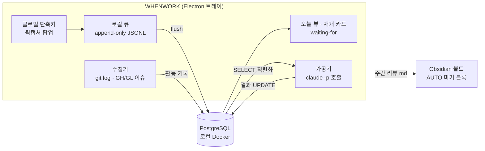
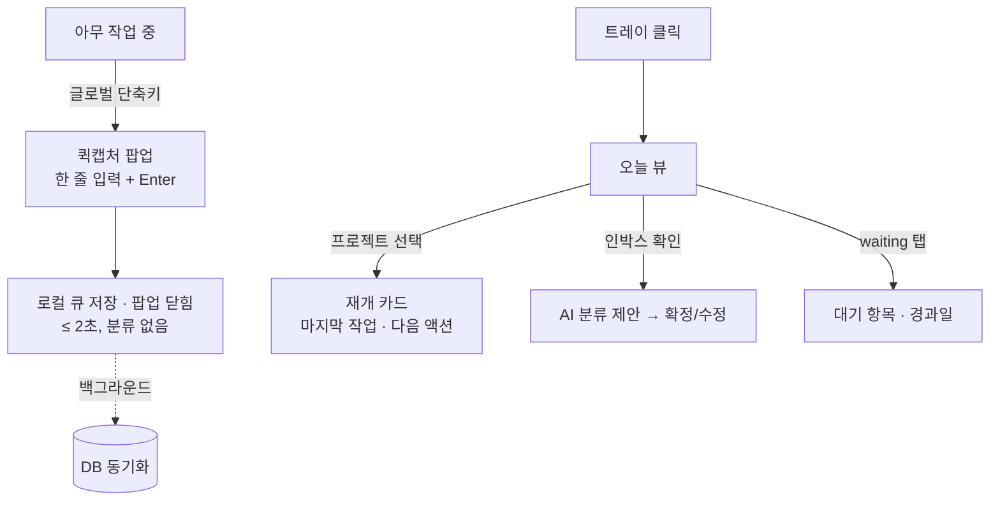

# WHENWORK 설계 v2.4

개인용 프로젝트별 업무 관리 트레이 앱. 2026-08-05 초안 (개정 이력은 문서 끝).

## 1. 배경·목적

여러 프로젝트(시재건설·서식갤러리·GoWrite·eformsign 등)를 오가며 일하는 1인 사용자의 업무 관리 도구.
기존 자동화(auto-worklog)가 **"한 일"의 수집은 해결**했으나, 다음 공백이 남아 있다:

1. **할 일 캡처** — 생각난 할 일이 머릿속·메신저·포스트잇에 흩어진다
2. **재개 컨텍스트** — 프로젝트 전환 시 "어디까지 했더라"를 매번 재구성한다
3. **대기 추적** — 남에게 요청해놓고 회신을 기다리는 항목이 잊힌다

목적 우선순위: **① 캡처 손실 제로 ② 컨텍스트 스위칭 비용 절감 ③ 주간 회고 자동화**

## 2. 페르소나 → 도출 요구

| 페르소나 특성 | 도출되는 요구 |
|---|---|
| 1인 사용자, 팀 협업 없음 | 권한·공유·멀티유저 기능 전면 배제 |
| 하루 종일 IDE·터미널에 있음 | 어디서든 닿는 글로벌 단축키 캡처, 키보드 중심 조작 |
| 도구에 기록할 시간이 없음 | **입력 비용 최소화가 제1원칙** — 캡처 시점에 분류를 강요하지 않는다 |
| 작업 흔적이 이미 git에 남음 | "한 일"은 자동 수집, 손 입력은 "할 일"에만 국한 |
| Claude 구독 보유, API 키 없음 | AI 가공은 `claude -p`(구독 OAuth)로 — 추가 비용 0 |
| Obsidian 볼트 운영 중 | 산출 문서(주간 리뷰)는 볼트와 공존 가능해야 함 |

## 3. 스코프

### v1 포함
- 트레이 상주 앱 (Windows 우선, claude-office 패턴)
- 글로벌 단축키 퀵캡처 (원라인 인박스)
- 오늘 뷰 (프로젝트 횡단)
- 프로젝트별 재개 카드 (git 활동 + AI 요약)
- waiting-for 추적
- 주간 리뷰 초안 (AI)

### v1 제외 (근거)
- 간트·의존성 그래프·리소스 관리 — 팀용 기능, 1인에게 과설계
- 시간 추적 — 캡처 부담을 늘림, 커밋 로그가 대체
- 모바일 — 사용 맥락이 PC 작업 중 캡처에 집중됨
- 알림·리마인더 — v2 후보 (오픈이슈 #3)

## 4. 벤치마크 요약

| 도구 | 취할 것 | 버릴 것 |
|---|---|---|
| Linear | 키보드 중심 속도, 자연어→이슈 | 팀·사이클 개념 |
| Things/OmniFocus | 퀵캡처 UX, 오늘 뷰, waiting-for(GTD) | 수동 입력 의존 |
| Obsidian Tasks | 로컬 소유권, 파일 친화 | 쿼리 성능·구조화 한계 |
| auto-worklog(자체) | 마커 블록, git 런타임 스캔, `claude -p` 가공 | — 그대로 계승 |

## 5. 아키텍처



### 핵심 설계 결정

| # | 결정 | 근거 | 폐기한 대안 |
|---|---|---|---|
| D1 | 캡처는 **로컬 큐 선기록 → DB 후동기화** | Docker 미기동 시에도 캡처가 절대 실패하지 않아야 함 (목적 ①) | DB 직접 INSERT — 의존성이 캡처 경로에 들어와 폐기 |
| D2 | 저장소 = **PostgreSQL (로컬 Docker)** | 구조화 쿼리(오늘 뷰·waiting-for 필터), 익숙한 스택(kwork365-be), 웹 UI 확장 여지 | SQLite — 의존성은 적으나 사용자가 Docker DB 운용을 선택. D1로 리스크 상쇄 |
| D3 | AI 호출 = **`claude -p` 구독 OAuth** | API 키 불필요, auto-worklog에서 검증된 패턴, 비용 0 | Agent SDK — 구독 인증 불가(API 키 필수)라 폐기. 정식 배포 시 재검토 |
| D4 | AI 쓰기는 **앱이 중개** — Claude는 텍스트만 반환 | 자동 실행에서 AI에 DB 쓰기 권한을 주지 않는다 (auto-worklog 관심사 분리 계승) | `--allowedTools`로 직접 쓰기 — 통제 불가라 폐기 |
| D5 | DB가 단일 원본, **볼트는 생성된 뷰** | "git이 원본, 볼트는 뷰"인 업무일지와 동일한 관계. 같은 내용을 양쪽에서 고치지 않는다 | 볼트를 원본으로 — 쿼리 불가·파싱 취약이라 폐기 |
| D6 | Electron **vanilla ESM + electron-builder** | claude-office에서 검증(빌드·트레이·아이콘 파이프라인 재사용). 프레임워크·번들러 무추가 | Next.js/React — v1 화면 3개에 과설계 |
| D7 | GH/GL 이슈는 **읽기 전용 캐시** — 수집기가 "내가 작성했거나 할당된 이슈"를 동기화, 원본은 GitHub/GitLab | 프로젝트 상세에서 이슈 확인 요구. 오프라인 시 마지막 캐시 표시. 조회는 `gh`/`glab` CLI 인증 재사용 | 앱 내 이슈 작성·편집 — 원본 이원화라 폐기. 클릭 시 브라우저로 이동 |

### AI 가공 단계 (유일한 `claude -p` 접점)

| 작업 | 트리거 | 입력 → 출력 |
|---|---|---|
| 인박스 분류 | 수동 또는 캡처 누적 시 | 미분류 항목 + 프로젝트 목록 → 프로젝트·태그 제안 (확정은 사용자) |
| 재개 카드 갱신 | 일 1회 + 수동 | 프로젝트별 최근 커밋·완료 항목 → "마지막 작업 / 멈춘 지점 / 다음 액션 1개" |
| 주간 리뷰 초안 | 주 1회 (금) | 주간 활동 전체 → 리뷰 md 초안 (볼트 AUTO 마커 블록에 삽입) |

## 6. 데이터 모델 (초안)

```
project    (id, name, repo_paths[], status, sort)
item       (id, project_id?, kind: inbox|todo|waiting, title,
            due?, waiting_for?, captured_at, done_at?, source: manual|ai)
activity   (id, project_id, occurred_at, kind: commit|note, ref, summary)   -- 수집기가 적재, 불변
issue      (id, project_id, provider: github|gitlab, number, title, state,
            relation: author|assignee|both, url, updated_at, synced_at)     -- 내 이슈 캐시(작성·할당), 읽기 전용 (D7)
resume_card(project_id PK, last_work, stuck_point, next_action, generated_at) -- AI 생성물, 항상 재생성 가능
```

원칙: **AI 생성물(resume_card, 분류 제안)은 언제든 버리고 재생성 가능**해야 한다. 사람 입력(item)과 자동 수집(activity)이 원본.

## 7. UX 플로우



게이트: 퀵캡처는 **입력→저장까지 어떤 선택지도 띄우지 않는다**. 분류·마감·프로젝트 지정은 전부 나중(인박스 정리 시점)으로 미룬다.

## 8. 마일스톤 — 단계별 주 액션 교체

| 단계 | 내용 | 사용자의 주 액션 | 완료 판정 |
|---|---|---|---|
| M1 | 트레이 + 퀵캡처 + 로컬 큐 + DB + 오늘 뷰 | "생각나면 단축키로 던진다" | 1주간 캡처 손실 0건 |
| M2 | git 수집기 + 재개 카드 (`claude -p`) | "프로젝트 열기 전에 카드부터 본다" | 카드만 보고 작업 재개 가능 |
| M3 | 인박스 AI 분류 + waiting-for + 주간 리뷰 | "금요일에 리뷰 초안만 다듬는다" | 리뷰 작성 시간 체감 절반 |

## 9. KPI

| 목표 | 지표 | 데이터원 |
|---|---|---|
| 캡처 손실 제로 | 일일 캡처 수 추이 (하락 = 도구 이탈 신호) | item.captured_at |
| 스위칭 비용 절감 | 재개 카드 열람 수 / 프로젝트 전환 수 | 앱 이벤트 로그 |
| 회고 자동화 | 주간 리뷰 초안 수정률 (낮을수록 초안 품질 ↑) | 볼트 diff |

## 10. 오픈이슈

- ~~**#1** 주간 리뷰의 볼트 출력 위치~~ — 닫음(2026-08-05). 같은 월 폴더에 **별도 파일** `00_업무일지/YYYY년/MM월/00_주간리뷰_YYYY-Www.md`. 일일 업무일지·월간요약(`AUTO:ROLLUP`)은 커밋에서 뽑은 "무엇을 했나"이고 주간 리뷰는 흐름·판단·다음 초점이라 성격이 달라 중복되지 않는다. 파일 안에서도 `AUTO:WEEKLY` 마커 안쪽만 갈아끼워 사람이 덧붙인 메모는 보존한다
- **#2** auto-worklog와 git 스캔 중복 — v1은 독립 스캔으로 가되, 안정화 후 수집기 공유 여부 재검토
- ~~**#3** 알림·리마인더(due 임박, waiting 경과)~~ — 닫음(2026-08-05). **아침 브리핑 하나로** 갈음한다: 설정 시각(기본 09:00) 이후 앱이 도는 첫 순간에 지연·오늘 마감·5일 넘은 대기·인박스 건수를 한 줄로 알린다. 항목마다 알리지 않는 이유는 개인용 도구에서 알림이 잦아지면 그때부터 전부 무시하게 되기 때문이다. 챙길 게 없으면 알리지 않고, 창(3시간)을 놓친 날은 조용히 넘겨 밀린 알림을 몰아 보내지 않는다. 판단은 `main/brief.mjs`(테스트 대상)
- **#4** `claude -p` 사용량이 구독 한도를 공유 — 가공 작업 빈도(일 1회·주 1회)로 충분히 낮게 유지, 초과 시 빈도 조정
- ~~**#6** 캘린더 연동~~ — 닫음(2026-08-06). **Apps Script 웹앱**으로 풀었다. 회사 Workspace가 iCal 비공개 주소를 막았고, 공개 iCal은 캘린더를 인터넷에 공개해야 하는 데다 "한가함/바쁨"이라 제목 없이 `Busy`만 왔다(`cid=...` 링크는 캘린더 ID의 base64일 뿐 인증 문제를 풀지 못한다). 웹앱은 **내 권한으로** 캘린더를 읽어 캘린더를 공개하지 않고도 제목까지 받고, GCP OAuth 클라이언트 발급도 필요 없으며, `getEvents`가 반복 일정을 이미 펼쳐 주므로 RRULE 해석도 우리 몫이 아니다. 스크립트는 `docs/apps-script-calendar.gs`. 대가는 배포를 "모든 사용자"로 열어야 한다는 것 — URL·토큰이 곧 비밀이라 내보내는 필드를 제목·시각·장소로 제한했다. 직접 만든 ics 파서(`main/ical.mjs`)는 이 경로에서 쓰이지 않지만 비공개 주소가 열릴 때를 위해 남겨 둔다
- ~~**#5** 이슈 수집의 계정 매핑~~ — 닫음(2026-08-05). `when630-forcs`(Mobility365 등) 리포는 당분간 쓰지 않기로 해 다중 계정 전환이 불필요해졌다. 현재 인증(`gh`=when630, `glab`=lab.oz4cs.com)으로 매핑된 프로젝트는 모두 조회된다. eformsign도 리포 연결 없이 둔다

## 11. UI 확정 사항 (목업 검토, `docs/mockups/`)

| 항목 | 결정 |
|---|---|
| 테마 | 다크 단일 (IDE 다크 환경 전제), 악센트 `#7aa2f7` 블루 |
| 트레이 창 | 880×680 화면 중앙(커서 디스플레이), 탭 4개(오늘/인박스/대기/프로젝트) `Tab` 순환. 단축키 재입력 또는 `Esc`로 닫힘 |
| 전역 캡처 핫키 | `Ctrl+Alt+Space` (기존 Claude 바인딩은 사용자가 해제) |
| 퀵캡처 | 선택 UI 없음. 저장해도 **창은 닫지 않는다** — 입력만 비우고 ✓ 피드백(연달아 던지기·앱 열기 대비). 닫기는 `Esc`/단축키 재입력, `Tab`은 오늘 뷰. DB 오프라인은 에러 아닌 상태(황색 큐 표시) |
| 입력 방어 | 전역 단축키의 Space가 입력창에 새는 문제 → **선두 공백 입력 금지**(타이밍 가드 아님). 단어 사이 공백은 그대로 |
| 창 스타일 | 그림자·라운드는 CSS가 아니라 Win11 네이티브. 프레임리스는 `resizable: false`면 WS_THICKFRAME이 빠져 둘 다 사라지므로, 창은 resizable로 두고 고정이 필요하면 min=max로 묶는다 |
| 창 위치 | 두 창 모두 드래그로 옮길 수 있고 옮긴 자리를 `userData/settings.json`에 기억한다. 저장된 자리가 지금 화면 밖이면(모니터 변경 등) 버리고 가운데로 — 트레이의 「창 위치 초기화」로도 되돌린다 |
| 프로젝트 인지 | 캡처 시 포그라운드 컨텍스트 자동 기록(창 아이콘 표식) + 인박스 AI 분류 기본, `#약어` 인라인 토큰은 옵션 |
| 글꼴 | 번들한 **Pretendard 가변**(`renderer/fonts`, OFL). CSP가 외부 로딩을 막으므로 파일 동봉. "Pretendard KR"이라는 별도 패밀리는 공식 배포에 없음 — 기본 Pretendard가 한글판이고 변형은 JP·Std·GOV |
| 아이콘 | 이모지 대신 **인라인 SVG 선 아이콘**(`renderer/icons.js`) — `currentColor`를 따라 색·크기가 폰트에 좌우되지 않는다 |
| 인박스 분류 키 | 2안 숫자 다이렉트 — `Enter` 제안 확정 · `1~9` 프로젝트 지정 · `W` 대기 · `X` 삭제 · 탭 전환은 `Tab` 순환 |
| 오늘 탭 | 프로젝트별 그룹핑, 마감 임박 우선 |
| AI 생성물 표식 | 보라 ✦ 상시 구분, 실패 시에도 git 활동·todo는 정상 표시 |
| 프로젝트 상세 | 3단 구성: AI 재개 카드 + git 활동 + 내 GH/GL 이슈(작성·할당 — 할당만은 「할당」 배지, 열림 우선, 클릭 시 브라우저, 오프라인은 캐시 황색 표시) |
| 프로젝트 관리 | 시드·하드코딩 없음 — 앱의 프로젝트 탭에서 추가(`N`)·이름(`E`)·약어(`A`)·리포 연결(`R`)·순서(`Shift+↑↓`)·보관(`X`). 순서가 인박스 `1~9` 번호. DB `project` 테이블이 유일 원본 |
| 스크롤 | 목록에서 `Home`/`End`/`PgUp`/`PgDn`은 스크롤이 아니라 **선택 점프**이고, 스크롤은 선택을 따라온다(`scrollIntoView({block:'nearest'})`). 문서형 화면(리뷰 본문·재개 카드·완료 기록)에서는 반대로 그 키들이 본문을 굴린다. 렌더가 본문을 통째로 다시 그리므로 스크롤 위치는 render가 기억해 되돌리고, 탭·뷰가 바뀔 때만 위로 올린다 |
| 삭제 | `X`는 **소프트 삭제**(`item.deleted_at`)이고 `U`로 되돌린다(연달아 지웠으면 누른 만큼 거꾸로). 30일이 지난 것만 실제로 지운다 — 한 키에 영구히 사라지는 항목이 있으면 "캡처 손실 0건"이 성립하지 않는다. 프로젝트 보관은 기존대로 `y` 확인 |
| 검색 | `/` 한 키. 제목·메모·프로젝트명·대기 상대를 낱말 AND로 훑고, **탭을 옮겨도 유지**하며 탭 배지 숫자를 매칭 건수로 바꾼다(어느 탭에 있는지 모르는 항목을 찾는 게 목적). `Esc`는 필터부터 풀고, 한 번 더 눌러야 창이 닫힌다 |
| 오늘 탭 | 지연·오늘 마감을 **맨 위 별도 그룹**("지금")으로 세우고 나머지는 프로젝트별. `F`로 마감 있는 것만 보기(방금 완료한 것은 남긴다). 배치는 `renderer/view.js`의 `todayGroups`가 유일한 기준 — 그리는 순서와 선택 인덱스가 같은 함수를 쓴다 |
| 완료 기록 | `H` — 최근 7일을 하루 단위로, 체크한 항목과 git 커밋을 함께. 오늘 뷰가 완료를 12시간만 남기므로 "어제 뭐 했지"를 볼 창구가 없었다. 커밋은 하루 12건까지만 보여주고 나머지는 건수로 접는다 |
| 설정 | 탭 하나(`설정`)에서 볼트 경로·백업 폴더(폴더 선택 다이얼로그)·아침 알림 on/off·시각. **DB 접속은 앱에서 만지지 않는다** — `settings.json`의 `db`를 고치고 재시작하는 쪽이 안전하다. 값이 비어 있으면 무엇이 대신 쓰이는지(자동 탐색 결과·기본 폴더)를 그 자리에 적는다 |
| 볼트 경로 | 코드에 박지 않는다. 설정에 없으면 홈 아래 두 단계까지에서 `00_업무일지`를 가진 폴더를 한 번 찾아 기억하고(못 찾으면 다시 훑지 않는다), 끝까지 없으면 초안은 DB에만 남는다 |
| 이슈·PR | `gh issue list`는 PR을 포함하지 않아 따로 긁는다. **리뷰 요청받은 PR**은 남을 막고 있는 일이라 열림 다음의 정렬 우선순위이고 AI 프롬프트에도 그렇게 알린다. 머지는 닫힘과 구분해 남긴다(그 작업이 끝났다는 신호). GitLab은 issue iid와 MR iid가 별개 공간이라 유일 키에 `kind`가 들어간다 |
| 백업 | 주간 리뷰를 만들 때 + 트레이·설정에서. `pg_dump`·docker에 기대지 않고 pg 접속만으로 전체 테이블을 JSON 한 파일에 담아 최근 8개를 남긴다 — 그 둘이 없거나 버전이 어긋나도 백업은 되어야 한다 |

## 12. 구현 현황 (2026-08-05)

M1·M2·M3 모두 구현. 8절 마일스톤 기준으로는 기능 스코프가 닫혔고, 남은 것은 실사용으로 확인할 것들뿐이다.

### 12.1 M3 이후 보강 (2026-08-05, 도그푸딩 1일차 점검)

| # | 항목 | 상태 |
|---|---|---|
| I | 선택 행·문서 스크롤 | ✅ 항목이 한 화면을 넘기면 `↓`를 눌러도 화면이 따라오지 않았다(`scrollIntoView`가 없었고 `#body`는 `tabindex="-1"`이라 기본 스크롤도 안 먹었다). 목록은 선택을 따라가고, 리뷰 본문·재개 카드·완료 기록은 `↑↓`·`PgUp`/`PgDn`·`Home`/`End`·`Space`로 굴린다 |
| J | 소프트 삭제 + 되돌리기 | ✅ `item.deleted_at`, `U` 되돌리기(스택), 30일 뒤 물리 삭제. 모든 조회에 `deleted_at IS NULL` |
| K | 볼트 경로 하드코딩 제거 + 설정 탭 | ✅ 개인 경로 상수를 없애고 규칙 기반 자동 탐색(`guessVaultRoot`)으로. 설정 탭에서 볼트·백업 폴더·알림을 직접 고른다. 네이티브 다이얼로그가 뜨는 동안은 blur로 창을 접지 않는다(`suppressHide`) |
| L | PR/MR 수집 | ✅ `gh pr list`(작성·`review-requested:@me`) / `glab mr list`(작성·리뷰어). `issue.kind`·`draft` 추가, 유일 키에 `kind` 포함, `relation`에 `reviewer` 추가. 재개 카드와 AI 프롬프트에 반영 |
| M | 아침 브리핑 알림 | ✅ 오픈이슈 #3을 닫았다. 판단은 `main/brief.mjs` |
| N | 백업 | ✅ pg 접속만으로 전체 테이블 JSON 덤프(`main/backup.mjs`), 리뷰 생성 시 자동 + 트레이·설정에서 수동, 최근 8개 유지 |
| O | 검색 | ✅ `/` — 전 항목 탭 공통 필터, 탭 배지가 매칭 건수 |
| P | 오늘 탭 필터 + 완료 기록 | ✅ "지금"(지연·오늘 마감) 그룹 분리, `F` 마감 필터, `H` 최근 7일 기록(항목 + 커밋) |
| Q | 렌더러 순수 로직 테스트 | ✅ 그리는 순서와 선택 인덱스가 어긋나 엉뚱한 항목이 지워졌던 곳(오늘 탭 배치)을 `renderer/view.js`로 떼어 검증. 단위 테스트 38 → 77건 |
| S | 캘린더 연동 | ✅ Apps Script 웹앱(오픈이슈 #6). 15분 폴링 → `cal_event` 캐시(끊겨도 마지막 일정은 보인다), 오늘 탭 상단 일정 띠(지난 것 흐리게·진행 중 강조), 아침 브리핑에 건수와 첫 일정, 주간 리뷰 재료에 그 주 회의. 토큰이 박힌 URL은 main에만 두고 화면에는 가린 값만 내려보낸다 |
| R | 스모크가 렌더러까지 | ✅ 창을 만들되 show하지 않고 탭을 한 바퀴 돌린 뒤 검색·완료 기록까지 열어 `window.onerror`·rejection을 수집한다. 임시 `userData`로 도는 이유는 실사용 인스턴스의 단일 인스턴스 락에 걸려 **아무것도 검증하지 않고 종료 코드 0으로 끝나던 것**을 막기 위해서다 |

| # | 항목 | 상태 |
|---|---|---|
| A | 로그인 시 자동 시작 + 설치본(NSIS) | ✅ 트레이 토글, 패키징본에서 기본 켜짐. 개발 실행은 등록하지 않는다 |
| B | 백그라운드 주기 수집 | ✅ 기동 30초 뒤 + 6시간마다 git·이슈. 트레이에 「지금 수집」·마지막 수집 시각 |
| C | 마감일 입력 | ✅ `D` 키 — `오늘 / 내일 / +3 / 8-12 / 2026-08-12`, 빈 값이면 해제 |
| D | M3 인박스 AI 분류 | ✅ 인박스 `A` — 캡처 컨텍스트까지 근거로 제안, `Enter`로 확정. 확신 없으면 제안하지 않는다 |
| E | M3 주간 리뷰 초안 | ✅ **앱의 리뷰 탭**에서 생성·열람(`G` 생성 · `←→` 주 이동 · `O` 볼트에서 열기). DB `review`가 원본이라 볼트 파일이 없어도 앱에서 볼 수 있고, 볼트 쓰기에 실패해도 초안은 남는다. 트레이 메뉴로 만들면 리뷰 탭이 열린다 |
| F | `#약어` 인라인 토큰 | ✅ 캡처 끝의 `#gw` → 인박스 건너뛰고 해당 프로젝트 todo로. 해석은 플러시 시점(캡처 경로는 DB를 모른다) |
| G | KPI 이벤트 로그 | ✅ `event` 테이블 — `resume_open`·`project_switch`(직전에 연 프로젝트와 다르면)·`inbox_classify`·`weekly_review` |
| H | 대기 재촉 메모 | ✅ `N` 키 (모든 항목 탭) |

남은 것: 오픈이슈 #2·#4. (오늘 탭의 의미는 12.1의 P로 정리했다 — 마감을 실제로 쓰고 있어서(todo 7건 중 3건) "지금" 그룹 분리 + `F` 토글로 갔고, 마감이 없는 항목을 숨기지는 않는다.)

## 개정 이력

- v1.0 (2026-08-05) 최초 작성 — 형태(트레이 앱)·저장소(Docker PostgreSQL)·AI 경로(`claude -p`) 확정
- v1.1 (2026-08-05) UI 목업 검토 반영 — 11절 추가 (테마·핫키·프로젝트 인지·키 세트)
- v1.2 (2026-08-05) 프로젝트 상세에 GH/GL 이슈 표시 — D7·issue 테이블·오픈이슈 #5 추가
- v1.3 (2026-08-05) 이슈 범위 확장 — 작성뿐 아니라 **할당된 이슈** 포함 (relation 필드 추가)
- v1.4 (2026-08-05) 프로젝트 관리 UI — 시드 제거, 프로젝트 탭에서 CRUD (프로젝트는 수시로 바뀐다는 피드백 반영)
- v1.5 (2026-08-05) 오늘 뷰 880×680 화면 중앙으로, 전역 단축키 토글(열려 있으면 닫힘)
- v1.6 (2026-08-05) 퀵캡처 저장 후 창 유지(연속 캡처), 선두 공백 차단, 창 그림자를 네이티브로
- v1.7 (2026-08-05) Pretendard 번들, 이모지 표식을 인라인 SVG 아이콘으로 교체
- v1.8 (2026-08-05) 창 드래그 이동·위치 기억(settings.json), 퀵캡처 높이 88px·플레이스홀더 제거
- v1.9 (2026-08-05) 오픈이슈 #5 닫음(다중 계정 불필요), 남은 과제를 12절로 정리
- v2.0 (2026-08-05) **M3 완료** — 인박스 AI 분류·주간 리뷰(오픈이슈 #1 확정)·마감일·메모·`#약어`·KPI 이벤트·자동 시작·주기 수집
- v2.1 (2026-08-05) 앱에 리뷰 탭 추가 — DB `review` 테이블이 원본, 볼트는 내보내기
- v2.4 (2026-08-06) 캘린더 연동 완료 — Apps Script 웹앱으로 오픈이슈 #6 닫음. 오늘 일정 띠·브리핑·주간 리뷰 반영
- v2.3 (2026-08-06) ics 파서 추가(`main/ical.mjs`) — 캘린더 연동 자체는 오픈이슈 #6으로 보류
- v2.2 (2026-08-05) 도그푸딩 1일차 점검 반영 — 스크롤·소프트 삭제·설정 탭·PR/MR·아침 브리핑(오픈이슈 #3 닫음)·백업·검색·완료 기록. 11절에 스크롤·삭제·검색·오늘 탭·설정·볼트·이슈·백업 결정 추가, 12.1절 신설
