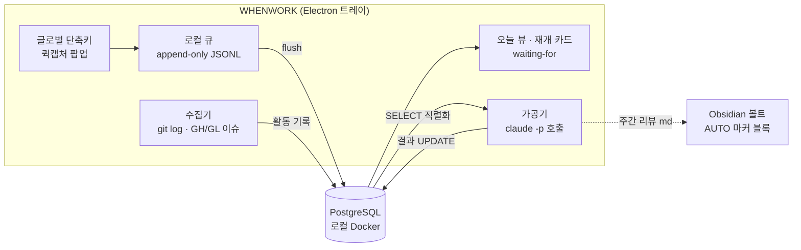
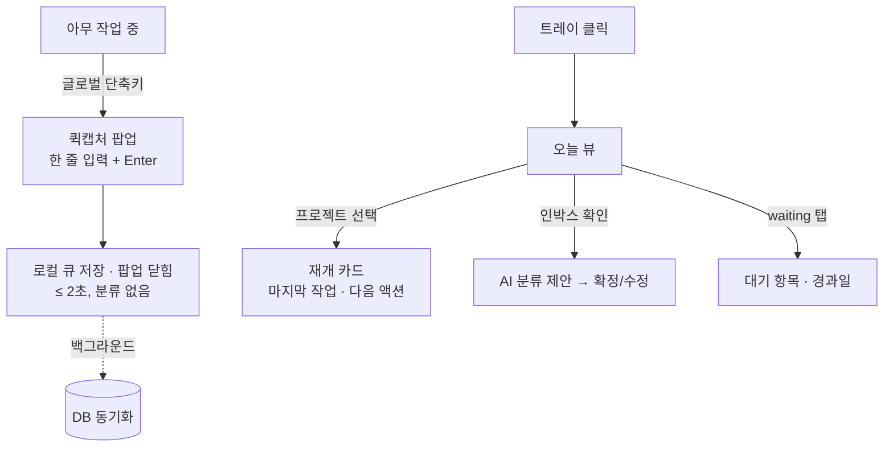

# WHENWORK 설계 v1.0

개인용 프로젝트별 업무 관리 트레이 앱. 2026-08-05 초안.

## 1. 배경·목적

여러 프로젝트(시재건설·서식갤러리·GoWrite·eformsign 등)를 오가며 일하는 1인 사용자의 업무 관리 도구.
기존 자동화(auto-worklog)가 **"한 일"의 수집은 해결**했으나, 다음 공백이 남아 있다:

1. **할 일 캡처** — 생각난 할 일이 머릿속·메신저·포스트잇에 흩어진다
2. **재개 컨텍스트** — 프로젝트 전환 시 "어디까지 했더라"를 매번 재구성한다
3. **대기 추적** — 남에게 요청해놓고 회신을 기다리는 항목이 잊힌다

목적 우선순위: **① 캡처 손실 제로 ② 컨텍스트 스위칭 비용 절감 ③ 주간 회고 자동화**

## 2. 페르소나 → 도출 요구

| 페르소나 특성 | 도출되는 요구 |
|---|---|
| 1인 사용자, 팀 협업 없음 | 권한·공유·멀티유저 기능 전면 배제 |
| 하루 종일 IDE·터미널에 있음 | 어디서든 닿는 글로벌 단축키 캡처, 키보드 중심 조작 |
| 도구에 기록할 시간이 없음 | **입력 비용 최소화가 제1원칙** — 캡처 시점에 분류를 강요하지 않는다 |
| 작업 흔적이 이미 git에 남음 | "한 일"은 자동 수집, 손 입력은 "할 일"에만 국한 |
| Claude 구독 보유, API 키 없음 | AI 가공은 `claude -p`(구독 OAuth)로 — 추가 비용 0 |
| Obsidian 볼트 운영 중 | 산출 문서(주간 리뷰)는 볼트와 공존 가능해야 함 |

## 3. 스코프

### v1 포함
- 트레이 상주 앱 (Windows 우선, claude-office 패턴)
- 글로벌 단축키 퀵캡처 (원라인 인박스)
- 오늘 뷰 (프로젝트 횡단)
- 프로젝트별 재개 카드 (git 활동 + AI 요약)
- waiting-for 추적
- 주간 리뷰 초안 (AI)

### v1 제외 (근거)
- 간트·의존성 그래프·리소스 관리 — 팀용 기능, 1인에게 과설계
- 시간 추적 — 캡처 부담을 늘림, 커밋 로그가 대체
- 모바일 — 사용 맥락이 PC 작업 중 캡처에 집중됨
- 알림·리마인더 — v2 후보 (오픈이슈 #3)

## 4. 벤치마크 요약

| 도구 | 취할 것 | 버릴 것 |
|---|---|---|
| Linear | 키보드 중심 속도, 자연어→이슈 | 팀·사이클 개념 |
| Things/OmniFocus | 퀵캡처 UX, 오늘 뷰, waiting-for(GTD) | 수동 입력 의존 |
| Obsidian Tasks | 로컬 소유권, 파일 친화 | 쿼리 성능·구조화 한계 |
| auto-worklog(자체) | 마커 블록, git 런타임 스캔, `claude -p` 가공 | — 그대로 계승 |

## 5. 아키텍처



### 핵심 설계 결정

| # | 결정 | 근거 | 폐기한 대안 |
|---|---|---|---|
| D1 | 캡처는 **로컬 큐 선기록 → DB 후동기화** | Docker 미기동 시에도 캡처가 절대 실패하지 않아야 함 (목적 ①) | DB 직접 INSERT — 의존성이 캡처 경로에 들어와 폐기 |
| D2 | 저장소 = **PostgreSQL (로컬 Docker)** | 구조화 쿼리(오늘 뷰·waiting-for 필터), 익숙한 스택(kwork365-be), 웹 UI 확장 여지 | SQLite — 의존성은 적으나 사용자가 Docker DB 운용을 선택. D1로 리스크 상쇄 |
| D3 | AI 호출 = **`claude -p` 구독 OAuth** | API 키 불필요, auto-worklog에서 검증된 패턴, 비용 0 | Agent SDK — 구독 인증 불가(API 키 필수)라 폐기. 정식 배포 시 재검토 |
| D4 | AI 쓰기는 **앱이 중개** — Claude는 텍스트만 반환 | 자동 실행에서 AI에 DB 쓰기 권한을 주지 않는다 (auto-worklog 관심사 분리 계승) | `--allowedTools`로 직접 쓰기 — 통제 불가라 폐기 |
| D5 | DB가 단일 원본, **볼트는 생성된 뷰** | "git이 원본, 볼트는 뷰"인 업무일지와 동일한 관계. 같은 내용을 양쪽에서 고치지 않는다 | 볼트를 원본으로 — 쿼리 불가·파싱 취약이라 폐기 |
| D6 | Electron **vanilla ESM + electron-builder** | claude-office에서 검증(빌드·트레이·아이콘 파이프라인 재사용). 프레임워크·번들러 무추가 | Next.js/React — v1 화면 3개에 과설계 |
| D7 | GH/GL 이슈는 **읽기 전용 캐시** — 수집기가 "내가 작성했거나 할당된 이슈"를 동기화, 원본은 GitHub/GitLab | 프로젝트 상세에서 이슈 확인 요구. 오프라인 시 마지막 캐시 표시. 조회는 `gh`/`glab` CLI 인증 재사용 | 앱 내 이슈 작성·편집 — 원본 이원화라 폐기. 클릭 시 브라우저로 이동 |

### AI 가공 단계 (유일한 `claude -p` 접점)

| 작업 | 트리거 | 입력 → 출력 |
|---|---|---|
| 인박스 분류 | 수동 또는 캡처 누적 시 | 미분류 항목 + 프로젝트 목록 → 프로젝트·태그 제안 (확정은 사용자) |
| 재개 카드 갱신 | 일 1회 + 수동 | 프로젝트별 최근 커밋·완료 항목 → "마지막 작업 / 멈춘 지점 / 다음 액션 1개" |
| 주간 리뷰 초안 | 주 1회 (금) | 주간 활동 전체 → 리뷰 md 초안 (볼트 AUTO 마커 블록에 삽입) |

## 6. 데이터 모델 (초안)

```
project    (id, name, repo_paths[], status, sort)
item       (id, project_id?, kind: inbox|todo|waiting, title,
            due?, waiting_for?, captured_at, done_at?, source: manual|ai)
activity   (id, project_id, occurred_at, kind: commit|note, ref, summary)   -- 수집기가 적재, 불변
issue      (id, project_id, provider: github|gitlab, number, title, state,
            relation: author|assignee|both, url, updated_at, synced_at)     -- 내 이슈 캐시(작성·할당), 읽기 전용 (D7)
resume_card(project_id PK, last_work, stuck_point, next_action, generated_at) -- AI 생성물, 항상 재생성 가능
```

원칙: **AI 생성물(resume_card, 분류 제안)은 언제든 버리고 재생성 가능**해야 한다. 사람 입력(item)과 자동 수집(activity)이 원본.

## 7. UX 플로우



게이트: 퀵캡처는 **입력→저장까지 어떤 선택지도 띄우지 않는다**. 분류·마감·프로젝트 지정은 전부 나중(인박스 정리 시점)으로 미룬다.

## 8. 마일스톤 — 단계별 주 액션 교체

| 단계 | 내용 | 사용자의 주 액션 | 완료 판정 |
|---|---|---|---|
| M1 | 트레이 + 퀵캡처 + 로컬 큐 + DB + 오늘 뷰 | "생각나면 단축키로 던진다" | 1주간 캡처 손실 0건 |
| M2 | git 수집기 + 재개 카드 (`claude -p`) | "프로젝트 열기 전에 카드부터 본다" | 카드만 보고 작업 재개 가능 |
| M3 | 인박스 AI 분류 + waiting-for + 주간 리뷰 | "금요일에 리뷰 초안만 다듬는다" | 리뷰 작성 시간 체감 절반 |

## 9. KPI

| 목표 | 지표 | 데이터원 |
|---|---|---|
| 캡처 손실 제로 | 일일 캡처 수 추이 (하락 = 도구 이탈 신호) | item.captured_at |
| 스위칭 비용 절감 | 재개 카드 열람 수 / 프로젝트 전환 수 | 앱 이벤트 로그 |
| 회고 자동화 | 주간 리뷰 초안 수정률 (낮을수록 초안 품질 ↑) | 볼트 diff |

## 10. 오픈이슈

- **#1** 주간 리뷰의 볼트 출력 위치 — `00_업무일지/` 월간 롤업과의 관계 정리 필요 (중복 서술 금지 원칙)
- **#2** auto-worklog와 git 스캔 중복 — v1은 독립 스캔으로 가되, 안정화 후 수집기 공유 여부 재검토
- **#3** 알림·리마인더(due 임박, waiting 경과) — v2에서 트레이 알림으로 검토
- **#4** `claude -p` 사용량이 구독 한도를 공유 — 가공 작업 빈도(일 1회·주 1회)로 충분히 낮게 유지, 초과 시 빈도 조정
- **#5** 이슈 수집의 계정 매핑 — GitHub 2계정(when630/when630-forcs)·GitLab을 프로젝트 리모트별로 어떤 인증으로 조회할지. `gh` 다중 계정 전환·`glab` 설정 확인 필요

## 11. UI 확정 사항 (목업 검토, `docs/mockups/`)

| 항목 | 결정 |
|---|---|
| 테마 | 다크 단일 (IDE 다크 환경 전제), 악센트 `#7aa2f7` 블루 |
| 트레이 창 | 480×660, 탭 3개(오늘/인박스/대기) `Tab` 순환 |
| 전역 캡처 핫키 | `Ctrl+Alt+Space` (기존 Claude 바인딩은 사용자가 해제) |
| 퀵캡처 | 선택 UI 없음, 저장 피드백 ✓ 400ms 후 자동 닫힘. DB 오프라인은 에러 아닌 상태(황색 큐 표시) |
| 프로젝트 인지 | 캡처 시 포그라운드 컨텍스트 자동 기록(📎) + 인박스 AI 분류 기본, `#약어` 인라인 토큰은 옵션 |
| 인박스 분류 키 | 2안 숫자 다이렉트 — `Enter` 제안 확정 · `1~9` 프로젝트 지정 · `W` 대기 · `X` 삭제 · 탭 전환은 `Tab` 순환 |
| 오늘 탭 | 프로젝트별 그룹핑, 마감 임박 우선 |
| AI 생성물 표식 | 보라 ✦ 상시 구분, 실패 시에도 git 활동·todo는 정상 표시 |
| 프로젝트 상세 | 3단 구성: AI 재개 카드 + git 활동 + 내 GH/GL 이슈(작성·할당 — 할당만은 「할당」 배지, 열림 우선, 클릭 시 브라우저, 오프라인은 캐시 황색 표시) |

## 개정 이력

- v1.0 (2026-08-05) 최초 작성 — 형태(트레이 앱)·저장소(Docker PostgreSQL)·AI 경로(`claude -p`) 확정
- v1.1 (2026-08-05) UI 목업 검토 반영 — 11절 추가 (테마·핫키·프로젝트 인지·키 세트)
- v1.2 (2026-08-05) 프로젝트 상세에 GH/GL 이슈 표시 — D7·issue 테이블·오픈이슈 #5 추가
- v1.3 (2026-08-05) 이슈 범위 확장 — 작성뿐 아니라 **할당된 이슈** 포함 (relation 필드 추가)
